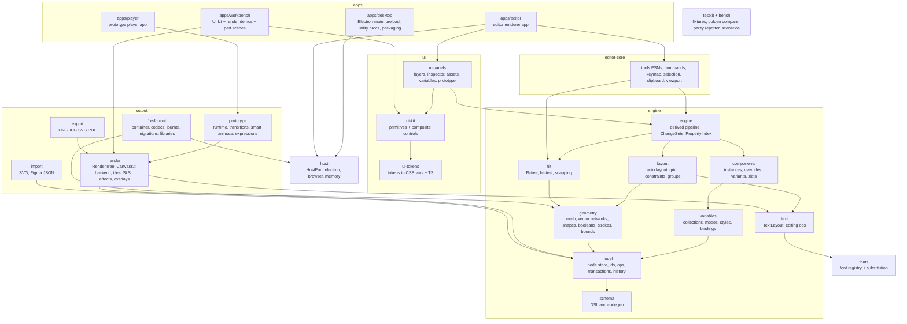
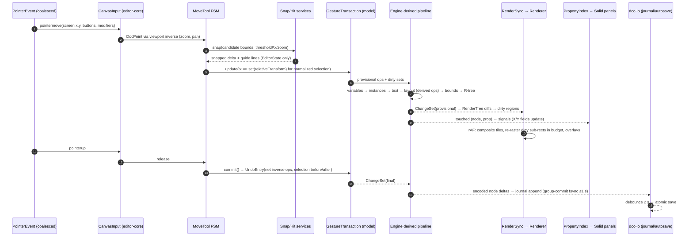

# Illigma: Application Architecture & Technology Stack

| | |
| --- | --- |
| **Status** | Proposed (planning phase). No application code exists yet. |
| **Date** | 2026-10-08 |
| **Implementation status of everything below** | **Not started.** This document claims no parity with Figma and no performance results. Every budget is a *target* until a benchmark in CI proves it. |
| **Product rule** | Figma decides how things behave: functionality, data model and edge cases. Framer decides how the editor chrome looks. When they conflict, follow Figma for behaviour and Framer for looks. |
| **Related documents** | `PLAN.md`. The parity specs `docs/parity/*.md` use these prefixes: CV canvas, FR frames, AL auto layout, VC vectors, PE paint/effects/export, TX text, CP components, DS design systems, PR prototyping, UX panels/workflow, IO file format/interop. The UI docs are `docs/ui/framer-visual-reference.md` and `docs/ui/design-system.md`. |

**Evidence tags** (used as defined in the planning brief):
- `[API]`: Figma Plugin API typings v1.141.0 or REST API types v0.44.0, read locally.
- `[DOC:<id>]`: an official Figma Help Center article.
- `[OBS]`: the read-only live-Figma observation of 2026-09-27.
- `[SRC:<url>]`: any other source. "(excerpt)" means only a search-engine excerpt was seen, not the full page.
- `[KNOW]`: the author's background knowledge, not verified in this session.

Any claim that affects correctness and rests only on `[KNOW]` or a third-party source is repeated in §12, *Needs live Figma verification*.

> **Research limitation (honest disclosure).** The shared web-search budget ran out partway through this research. Package facts were checked directly against the npm registry (Appendix A). Library capabilities were checked by downloading and inspecting `canvaskit-wasm@0.42.0`. The Figma data model was read from the local typings. Several facts that are not about Figma (for example Electron binary sizes, Loro internals and Figma blog content I did not re-read) are therefore tagged `[KNOW]` and come with a verification action.

---

## 0. Decision summary (the recommended stack)

| ADR | Concern | Decision | Named fallback |
| --- | --- | --- | --- |
| 001 | Desktop shell | **Electron 44.x** (Chromium 152, Node 24.21), so every OS runs the same rendering engine. A **Chromium browser build** of the same editor is kept for development, CI and demos. | Tauri 2.12, allowed only if the WebView parity matrix in ADR-001 passes |
| 002 | Engine language & threads | **TypeScript (strict)**, with the engine running on the editor renderer's main thread. WASM is used only where it buys correctness or speed (CanvasKit). I/O, decoding, export and font scanning run off-thread. Rust→WASM *kernels* are an escape hatch behind a numeric trigger. | A Rust core that owns model, layout and render in WASM, in the style of Penpot `render-wasm` |
| 003 | Canvas rendering | **CanvasKit 0.42 (Skia/WASM, WebGL2)**. A retained **RenderTree** receives diffs. A **tile cache** and a **per-node SkPicture cache** sit underneath, with an overlay pass on top. A reproducible **custom CanvasKit build** starts at M2. | A custom WebGPU renderer (Figma's current direction), evaluated after M8 |
| 004 | Render correctness | Each Figma paint, stroke and effect has an explicit implementation: SkSL runtime effects for noise, texture, glass, progressive blur, diamond gradient and linear burn; clip-based inside/outside strokes; a corner-smoothing path generator. Correctness is judged by golden-image tolerance against Figma exports. | n/a |
| 005 | Hit-testing & snapping | **CPU geometric hit-testing**, separate from rendering, over a per-page R-tree. Tolerances are in **screen pixels** and converted with the zoom. | GPU picking buffer, for very dense scenes only |
| 006 | Geometry | Illigma's own **vector-network** model in TS. **Skia PathOps** handle booleans. A custom stroker handles networks, variable width and per-side weights. Both `absoluteBoundingBox` and `absoluteRenderBounds` are computed. | PathBool.js (`path-bool`) for booleans |
| 007 | Text layout | **SkParagraph (HarfBuzz + ICU, inside CanvasKit)** does shaping, bidi, line breaking and font fallback. Illigma's own **Figma text-box layer** handles line height, baseline, leading trim, lists, paragraph spacing, truncation, balance/pretty and text on path. Its output is one `TextLayout` contract. | Custom line layout over `harfbuzzjs` 1.6.3 behind the same contract |
| 008 | Fonts | A native **font-service** utility process scans and indexes system fonts. Inter is bundled. Font bytes are streamed into a CanvasKit `TypefaceFontProvider`. Fonts are substituted deterministically when missing. | Chromium `queryLocalFonts()` |
| 009 | Layout | A **custom Figma-semantics solver in TS** for auto layout (stack, wrap, grid, min/max, absolute, baseline), constraints and groups. Relayout is incremental and **versioned per frame**. | Port the solver to Rust→WASM (not Yoga or Taffy) |
| 010 | Document model | A normalized node store keyed by id. **One schema DSL** (Figma property names) generates types, codecs, validators, override and binding tables, and a coverage check against `@figma/plugin-typings`. | n/a |
| 011 | Transactions & undo | Every change goes through a **transaction** made of property-level ops. Gesture transactions are open while a gesture runs and are committed once. Undo entries store inverse ops plus selection. There is one history per document, shared by all panels. | n/a |
| 012 | Sync readiness | A **custom op log** in the same shape as Figma multiplayer (per-property last-writer-wins plus parent pointer and fractional index). No CRDT library sits in the core. | Loro 1.x as a sync layer later |
| 013 | Derived data & reactivity | An ordered derived pipeline: variables → instances → text → layout → geometry/bounds → render diff. Panels subscribe through a (node, property) index exposed as signals. **The canvas never renders through the UI framework.** | n/a |
| 014 | Components | Instances are **materialized lazily** from the main component plus an **override map keyed by stable path ids**. Slots are instance-owned subtrees. Edits propagate through a dependency index. | n/a |
| 015 | Variables & styles | A resolver that tracks mode context (explicit and inherited modes, extended collections, aliases), with a binding dependency index and memoized resolved values. | n/a |
| 016 | Prototyping | A separate **prototype runtime** (a pure state machine) plus a **player window** that reuses the render core and receives a live snapshot and diffs. | n/a |
| 017 | File format | `.illigma` is a **single-file ZIP container**: msgpack node-table chunks per page, content-addressed blobs, a manifest, and optional history and caches. Saves write a temp file, fsync it and atomically replace the original. | SQLite single-file (`node:sqlite`) |
| 018 | Autosave & recovery | A **binary journal** in app data (group-committed, fsync at most every 1 s, with CRC on each record), debounced autosave, crash recovery, chunk-deduplicated version history, and forward-only migrations. | n/a |
| 019 | Local libraries | Any `.illigma` can publish a library. Consumers link it by `documentId` and store versioned asset snapshots. Updates must be reviewed and accepted. | n/a |
| 020 | Export & import | PNG/JPG through CanvasKit raster. SVG through Illigma's own writer. PDF through **SkPDF in the custom CanvasKit build**. SVG import and Figma-JSON import come at M8. | PDF through a `pdfkit` writer from the display list |
| 021 | UI framework | **SolidJS 1.9** (fine-grained signals) with Zag.js/Ark UI headless primitives and virtualized lists. | React 19.3 with `useSyncExternalStore` |
| 022 | UI kit | Tokens → primitives → composite controls → panels, written in CSS Modules over CSS variables. An in-repo **Workbench** app handles states and visual tests. | Storybook 10 (`storybook-solidjs-vite`) |
| 023 | Repo & tooling | pnpm workspaces, Turborepo, Vite 8, **TypeScript 7 strict**, Biome, dependency-cruiser, electron-vite and electron-builder. | Electron Forge 8 |
| 024 | Tests & parity | Vitest unit and numeric golden tests, CanvasKit CPU golden images, Playwright (browser and Electron), benchmarks in CI, and a **parity matrix generated from tests tagged with checklist IDs**. | n/a |
| 025 | Figma fixtures | A **dev-only Figma plugin** exports `JSON_REST_V1`, geometry and PNG/SVG/PDF renders from a **user-designated disposable file**, with read-only REST as an alternative. The same scenario scripts run in both Figma and Illigma. | n/a |
| 026 | Security & offline | A hardened Electron configuration with no network by default and no account. Telemetry is off. The only outbound actions are explicit user actions. | n/a |
| 027 | Interaction architecture | Tools are state machines. Commands live in a registry. A scoped keymap keeps IME and text input apart from global shortcuts. Pointer capture is robust. | n/a |

**Top risks:** rendering fidelity of effects and text (R-01, R-03), JS↔WASM and GC overhead at 10k+ visible nodes (R-02), auto-layout and component semantic parity (R-04, R-05), and data loss from saves on Windows or in cloud-synced folders (R-07). See §10.

---

## 1. Requirements and quality attributes

| ID | Requirement | Measurable target (validated by) |
| --- | --- | --- |
| QA-01 | Local-first: works fully offline, needs no account, stores projects locally | Every feature passes the E2E suite with networking disabled at the OS level (ADR-026) |
| QA-02 | Canvas performance | 60 fps (p95 frame ≤ 16.7 ms) for pan, zoom and drag with **10k+ nodes on screen**; files of **100k+ nodes** open and edit (§8) |
| QA-03 | Rendering accuracy | Figma-like output for fills, gradients, images, strokes, effects, blend modes, masks, booleans and vector networks, within golden-image tolerances (ADR-004, ADR-024) |
| QA-04 | Fast text | Typing latency ≤ 16 ms p95 for a 2,000-character node; text is laid out once and drawn from cached glyph runs |
| QA-05 | Modular, scalable editor | Package layering enforced by dependency-cruiser in CI; no cycles between packages |
| QA-06 | Full undo/redo | Transactional, coalesces continuous gestures, covers edits from every panel; fuzz-tested so that applying ops, undoing all and redoing all returns to the expected states (§6) |
| QA-07 | Reliable saving | Atomic writes, autosave, crash recovery, versioning and migrations; fault-injection tests show that after a crash at any step the file is either the old version or the new one, never a mix (ADR-017/018) |
| QA-08 | Reusable UI components | Framer-styled kit; every component appears in the Workbench in every state; no raw colours outside tokens (lint) |
| QA-09 | Full Figma data model | Schema coverage report against `@figma/plugin-typings` 1.141.0: every property is either mapped or explicitly deferred with a parity ID (ADR-010) |
| QA-10 | Testable parity | Every parity checklist ID maps to at least one test before it can reach status *Implemented* (ADR-024) |

---

## 2. What was checked in this session

- **Figma data model, read locally** `[API]`:
  - The `SceneNode` union includes `SLOT`, `TRANSFORM_GROUP`, `TEXT_PATH`, `SECTION`, `SLICE` and FigJam/Slides nodes.
  - `layoutMode` takes `'NONE' | 'HORIZONTAL' | 'VERTICAL' | 'GRID'`.
  - `primaryAxisAlignItems` includes `SPACE_EVENLY` and `SPACE_AROUND`. Other auto-layout properties: `counterAxisAlignContent`, `strokesIncludedInLayout`, `itemReverseZIndex`.
  - Grid tracks are `FLEX | FIXED | HUG`, with `gridAutoTracks: 'NONE' | 'ROWS'`.
  - Effects are `DROP_SHADOW`, `INNER_SHADOW`, `LAYER_BLUR` and `BACKGROUND_BLUR` (each blur `NORMAL` or `PROGRESSIVE`), plus `NOISE`, `TEXTURE`, `GLASS` and `SHADER`.
  - Paints are `SOLID`, `GRADIENT_*`, `IMAGE`, `VIDEO`, `PATTERN` and `SHADER`.
  - Strokes add `variableWidthStrokeProperties`, `complexStrokeProperties` (brushes and dynamic strokes) and arrow caps.
  - Variables:
    - `VariableResolvedDataType` adds `EASING` and `TIMING` to the usual types.
    - Extended collections are modelled as `ExtendedVariableCollection` with `parentVariableCollectionId`, `rootVariableCollectionId` and `variableOverrides`.
    - Nodes carry `explicitVariableModes` and `resolvedVariableModes`.
  - Text adds `leadingTrim`, `listOptions`, `textTruncation`/`maxLines` and `textWrapStyle: AUTO | BALANCE | PRETTY`.
  - `documentColorProfile` is `LEGACY | SRGB | DISPLAY_P3`.
  - `figma.commitUndo()` and `saveVersionHistoryAsync()` exist.
  - `exportAsync` supports `JSON_REST_V1`, `PNG`, `JPG`, `SVG`, `PDF`, `MP4`, `GIF` and `WEBM`.
  - The REST API offers `geometry=paths` (`fillGeometry`/`strokeGeometry`) and `absoluteRenderBounds`.
- **CanvasKit 0.42.0, tarball inspected locally** `[SRC:https://registry.npmjs.org/canvaskit-wasm]`:
  - Released 2026-08-18. Since 0.41.0, `Path` objects are immutable and built with `PathBuilder`.
  - The default `bin/canvaskit.wasm` is 7.3 MB. Its JS glue exposes `MakeWebGLContext` but **no WebGPU entry points**, even though the typings declare `MakeGPUDeviceContext`.
  - It ships `ParagraphBuilder` (SkParagraph with ICU), `RuntimeEffect` (SkSL, including `MakeForBlender`), PathOps (`MakeFromOp`), `getShapedLines`, `MakeSWCanvasSurface` (deterministic CPU raster), `TextBlob.MakeFromRSXform`, the `DISPLAY_P3` colour space, and `EmbindObject.delete()`, which means memory is managed manually.
- **Electron 44.7.0**, the latest release (2026-10-07): Chromium `152.0.7977.130`, Node `v24.21.0` `[SRC:https://raw.githubusercontent.com/electron/electron/v44.7.0/DEPS]`.
- **Tauri on Linux**: WebKitGTK can put WebGL/canvas on a slow or software path *silently*, context creation succeeds anyway, and the renderer string is masked. Tauri's own advice is to ship a non-WebGL fallback on Linux `[SRC:https://v2.tauri.app/develop/debug/linux-graphics/ (excerpt)]`. WebKitGTK had no WebGPU support or plan in 2023 `[SRC:https://lists.webkit.org/pipermail/webkit-gtk/2023-October/003947.html (excerpt)]`. Safari/WKWebView WebGPU starts with macOS 26 `[SRC:https://web.dev/blog/webgpu-supported-major-browsers (excerpt)]`.
- **Figma's renderer**:
  - It is C++ compiled to WASM with Emscripten, and also compiled natively for server-side rendering and tests.
  - Figma migrated it from WebGL to WebGPU. Along the way they made draw-call inputs explicit and kept the WebGL path working.
  - Figma's shaders run as WebGPU pipelines.
  - Source for all three points: `[SRC:https://www.figma.com/blog/figma-rendering-powered-by-webgpu/ (excerpt)]`.
- **Penpot `render-wasm`**: a Rust crate targeting `wasm32-unknown-emscripten` that uses Skia through custom rust-skia binaries. It produces one speed-tuned and one size-tuned target from the same source `[SRC:https://raw.githubusercontent.com/penpot/penpot/develop/render-wasm/README.md]`. A talk describes tiling with viewport culling and tile caching `[SRC:https://platform-v2.wearedevelopers.com/videos/1353/rendering-design-software-in-the-browser-at-penpot (excerpt)]`.
- **Taffy** implements CSS Block, Flexbox and Grid `[SRC:https://raw.githubusercontent.com/DioxusLabs/taffy/main/README.md]`. **Kiwi**, the schema-based binary format by Figma's co-founder, has optional-field presence and forward compatibility through an embedded schema `[SRC:https://raw.githubusercontent.com/evanw/kiwi/master/README.md]`.
- **Local Font Access API**: `queryLocalFonts()` returns `FontData` with `blob()` bytes and needs the `local-fonts` permission. It is available in Chromium 103+ and not in Firefox or Safari `[SRC:https://developer.mozilla.org/en-US/docs/Web/API/Window/queryLocalFonts (excerpt)]`.

---

## 3. System overview

### 3.1 Process and thread model

```
┌──────────────────────────── Electron main process (Node 24) ────────────────────────────┐
│ app lifecycle · BrowserWindows · native menus (from Command Registry) · dialogs ·       │
│ single-instance lock · file associations · auto-update (opt-in) · IPC/MessagePort broker │
│ (thin: never parses documents, never renders)                                           │
└───────┬───────────────────────────────┬───────────────────────────────┬─────────────────┘
        │ MessagePort                   │ MessagePort                   │ MessagePort
┌───────▼──────────────┐   ┌────────────▼────────────┐    ┌─────────────▼──────────────┐
│ utilityProcess        │   │ utilityProcess          │    │ utilityProcess (pooled)    │
│ doc-io (1 per doc)    │   │ font-service (shared)   │    │ library-watch (shared)     │
│ persisted mirror,     │   │ scan + index + bytes    │    │ linked library files,      │
│ journal, ZIP writer,  │   │ (fontkit), fs watch     │    │ change detection           │
│ atomic replace,       │   └─────────────────────────┘    └────────────────────────────┘
│ recovery, migrations  │
└───────▲──────────────┘
        │ op stream (encoded node deltas), save/load
┌───────┴──────────────────────── Editor renderer process (1 per document window) ───────┐
│ MAIN THREAD: engine (model · transactions · derived pipeline · layout · text · hit)    │
│              tools/commands/keymap · Solid UI panels · CanvasKit WebGL2 canvas          │
│ WORKERS: image-worker (decode/resize/mips/hash) · export-worker (own CanvasKit,         │
│          OffscreenCanvas/CPU) · geometry-worker (large boolean/outline ops, async)      │
└───────┬───────────────────────────────────────────────────────────────────────────────┘
        │ MessagePort: snapshot + ChangeSet diffs
┌───────▼──────────────────────── Player window renderer (Present / prototype) ──────────┐
│ prototype-runtime (state machine) · render core (same RenderTree + CanvasKit backend)  │
└───────────────────────────────────────────────────────────────────────────────────────┘
```

The **browser build** uses the same editor app. Its `HostPort` implementation maps each service to a browser API:
- `doc-io` runs in a Web Worker using OPFS for journal and recovery, plus the File System Access API for open and save (Chromium only).
- `font-service` uses `queryLocalFonts()`.
- The player runs in a new tab or a `window.open` window.

The browser build exists for the development loop, fast CI and demos. It is **not** a supported end-user target unless PLAN.md says otherwise.

### 3.2 Package diagram



**Layering rules** (enforced by `dependency-cruiser` in CI):
1. `schema` and `model` have no DOM and no CanvasKit dependency. `geometry`, `layout`, `variables`, `components` and `engine` are pure TS that runs in Node, so headless tests and the export worker can use them.
2. `text` and `render` may depend on CanvasKit. **Nothing below `render` may import `render`.**
3. `render` reads only the RenderTree and the `TextLayout`/geometry outputs. It never touches the node store. This seam lets the renderer move to a worker or be swapped for another backend.
4. UI packages (`ui-*`) never import `render`. The editor app wires the canvas.
5. `host` is the only package that touches the platform: fs, dialogs, fonts, windows, clipboard.

### 3.3 Architecture invariants (normative; AGENTS.md repeats them)

| ID | Invariant |
| --- | --- |
| INV-01 | **Every document change goes through a transaction.** No code path mutates node records outside `doc.transact` or an open `GestureTransaction`. A debug build freezes records outside a transaction to catch violations. |
| INV-02 | **Transient UI state never mutates document geometry.** Hover, marquee, snap guides, drag previews, viewport, panel expansion and the selection outline belong to `EditorState` and never to the document. |
| INV-03 | **Continuous pointer gestures survive re-renders and lost capture.** Gesture state lives in the tool FSM, not in UI components. On `lostpointercapture`, window `blur` or `visibilitychange`, the gesture finishes deterministically, either committed or cancelled according to the tool's policy, and never stays half-applied. |
| INV-04 | **A selected ancestor moves its descendants exactly once.** Transform tools normalize the selection by removing descendants of selected ancestors before applying deltas. |
| INV-05 | **Frame selection bounds use the frame's own box, not the union of its children.** The same applies to any node with its own geometry. Groups derive their bounds from their children. |
| INV-06 | **Typing and IME are separate from global shortcuts.** While a text field or canvas text edit has focus, or an IME composition is active, single-key and character shortcuts are suppressed. Only the commands registered for that scope run. |
| INV-07 | **Hit tolerances are in screen pixels; geometry is in document coordinates.** Every tolerance is converted using the current zoom and device pixel ratio. |
| INV-08 | **Determinism.** For a given document plus font set and engine version, layout, geometry and text results are bit-reproducible. Golden tests depend on this. |
| INV-09 | **Unknown data survives a round trip.** Fields and extensions the reader does not understand are preserved verbatim on save (ADR-017). |
| INV-10 | **Every derived write is recorded.** Layout and resolution results written into the document happen inside the triggering transaction, so undo restores them exactly (ADR-011). |

---

## 4. Architecture Decision Records

Format: **Context · Options · Decision · Consequences · Risks · Revisit when**.

### ADR-001: Desktop shell: Electron (plus a Chromium browser build)

**Context.**
- The app needs file-system access, native menus, multiple windows (the prototype player), system font enumeration, auto-update and offline operation.
- The decisive factor is **identical GPU rendering behaviour on macOS, Windows and Linux**. The whole canvas is WebGL2 (later possibly WebGPU) driven by WASM. Rendering inconsistencies would undermine Figma-parity golden tests on every platform.

**Options.**

| Option | Pros | Cons |
| --- | --- | --- |
| **Electron 44** (Chromium 152, Node 24.21) `[SRC:electron DEPS]` | The same Chromium build on all three OSes, so goldens are identical everywhere. `utilityProcess` and `MessagePort` give clean off-thread services. `queryLocalFonts` and WebGPU follow Chromium (Chromium-only API `[SRC:MDN queryLocalFonts (excerpt)]`). Playwright drives Electron. Mature updater and signing (electron-builder 26.15.3, electron-updater 6.8.9). Figma's own desktop app is understood to be Electron-based `[KNOW]`. | Large binaries (installers around 100 MB or more `[KNOW]`), roughly 100–200 MB memory per renderer `[KNOW]`, Chromium security update cadence. |
| **Tauri 2.12** (WKWebView / WebView2 / WebKitGTK) | Small binaries (a few MB `[KNOW]`), Rust backend, low baseline memory. | **Three different engines.** On WebKitGTK, WebGL can drop to a slow or software path silently and the renderer string is masked; Tauri advises a non-WebGL fallback on Linux `[SRC:v2.tauri.app linux-graphics (excerpt)]`. No WebGPU on WebKitGTK `[SRC:webkit-gtk list (excerpt)]`, and WKWebView WebGPU only from macOS 26 `[SRC:web.dev (excerpt)]`. No `queryLocalFonts` in WebKit `[SRC:MDN (excerpt)]`. Golden images would differ per OS. Testing ×3. |
| **Browser-only PWA** (OPFS + File System Access) | Zero install. | File System Access is Chromium-only, background fsync guarantees are weaker, there is no native menu or multi-window control, and system fonts need a permission prompt. It conflicts with the "desktop app" requirement. |

**Decision.**
- Ship on **Electron**, pinned to a stable major and updated at least every 8 weeks.
- Keep a **browser build** of the same editor for development, CI (faster Playwright runs) and demos, through `HostPort`.
- macOS uses the native menu bar. Windows and Linux use a frameless window with an in-app menu built from the same Command Registry. Its visuals follow `docs/ui/design-system.md`.
- **Window policy:** one renderer process per open document, which isolates crashes. A tabbed shell using `WebContentsView` may come later (UX decision).

**Consequences.**
- Larger download. Rendering, fonts and APIs are identical everywhere.
- Native features (fonts, file I/O, recovery) live in Node utility processes behind `HostPort`.

**Risks.** Memory per window (R-10). Chromium GPU blocklists on old drivers (R-11). Code signing and notarization cost (open question Q-6).

**Revisit when** a WebView parity matrix (WebGL2 conformance subset, CanvasKit golden suite, `queryLocalFonts` substitute, performance suite) passes on WKWebView, WebView2 and WebKitGTK. Only then can Tauri be considered for size.

---

### ADR-002: Engine language and thread model

**Context.**
- Hot paths (layout, text, geometry, hit-testing, render submission) all read the scene graph.
- Figma keeps its document and renderer in C++/WASM `[SRC:figma blog (excerpt)]`. Penpot moved rendering to Rust with Skia in WASM `[SRC:penpot README]`.
- Illigma will be built largely by AI-assisted contributors. Iteration speed, debuggability and a single language matter a great deal.

**Options.**

| Option | Pros | Cons |
| --- | --- | --- |
| **A. TypeScript engine plus CanvasKit (WASM)** | One heap and language for model, tools, layout, panels and tests, so panel reads need no marshaling. DevTools debugging, Vite hot reload. Skia correctness for paths, booleans, text and effects comes for free through CanvasKit. Easy for agents to work in. | A JS↔WASM call per draw, GC pauses, manual `delete()` of Skia objects, a lower performance ceiling than native. |
| B. Rust (or C++) core in WASM that owns model, layout and render (Figma/Penpot style) | Highest performance ceiling, control over memory layout, native builds for headless tests and CLI. | Two languages, a foreign-function call for every UI read, custom Skia binaries for Emscripten (Penpot maintains its own `[SRC:penpot README]`), slower builds and iteration, harder debugging. |
| C. TS model with a Rust mirror for render and layout | Fast render. | Two sources of state and complex synchronization. |

**Decision: A**, with two seams designed in from day one:
1. **Render seam.** `render` consumes only RenderTree diffs, which are plain data with typed arrays for paths and transforms. The backend can therefore move to a worker (OffscreenCanvas) or be replaced (Rust skia-safe, or WebGPU) without engine changes.
2. **Kernel seam.** Hot algorithms (layout solve, R-tree, path flattening, stroke outlining, text line fitting) sit behind pure functions with typed-array inputs and outputs, so each can be ported to Rust→WASM (`wasm-pack` 0.15) on its own.

**Thread placement.**
- The main thread holds the engine, tools, UI and canvas.
- Off-thread work: image decode, export, font scanning, persistence encoding and writing, and very large boolean or outline operations.
- During a frame the main thread runs ingest → commit → derived → render-submit within the frame budget (§5.2).
- Tile rasterization is **time-sliced** and never blocks input.

**Consequences.**
- Memory discipline is required: an owner wrapper around every CanvasKit object (`using`/`dispose` with per-frame arenas), a `FinalizationRegistry` leak detector in debug builds, and pooled typed arrays.
- The model stores Float64 values. Hot derived data (world transforms, bounds, flags) goes into struct-of-arrays typed arrays indexed by dense u32 node handles.

**Risks.** R-02 (overhead), R-15 (Skia API churn).

**Revisit when** the M0 benchmark gate (PB-01…PB-05) misses its target on the reference hardware by more than 20% after optimization, **and** profiles attribute more than 40% of frame time to JS↔WASM crossings or GC. Then open ADR-002b to move the render core (and possibly layout) to Rust/WASM.

---

### ADR-003: Canvas rendering backend

**Context.**
- Accuracy targets: fills, gradients (linear, radial, angular, diamond), images (FILL/FIT/CROP/TILE plus filters), strokes (inside/outside/center, dashes, caps, per-side weights, variable width), effects (shadows, layer/background/progressive blur, noise, texture, glass), 19 blend modes including `PASS_THROUGH`, three mask types, booleans, vector networks and text `[API]`.
- Performance targets: 10k visible nodes at 60 fps.

**Options.**

| Option | Pros | Cons |
| --- | --- | --- |
| **CanvasKit (Skia WASM), WebGL2/Ganesh** | Production-grade path rendering and AA, PathOps, image filters, SkSL runtime effects and blenders, SkParagraph, CPU raster for deterministic tests, runs in Node. Google-maintained; 0.42.0 released 2026-08-18. | A 7.3 MB WASM file, embind call overhead, manual memory, no WebGPU in the npm build (verified), occasional breaking API changes (immutable `Path` in 0.41). |
| Custom WebGL2/WebGPU renderer | Full control. The approach Figma took over roughly ten years `[SRC:figma blog (excerpt)]`. | Years of work on path tessellation, AA, stroking, filters and text, with high correctness risk. |
| PixiJS 8.22 / three.js | Fast sprite and mesh batching. | Not a vector-graphics engine. Paths, strokes, filters and text fidelity would all need rebuilding. |
| Canvas 2D / SVG DOM | Simple. | Too slow at scale (Penpot left SVG for this reason `[SRC:penpot talk (excerpt)]`). Platform-dependent output, no booleans, blend-mode and filter gaps. |

**Decision: CanvasKit with a retained RenderTree.** Design:

1. **RenderTree.**
   - One `RenderNode` per *rendered* node. This includes materialized instance sublayers.
   - Each holds the resolved world transform, clip/mask relations, opacity and blend mode, isolation flag, geometry handles (fill path, stroke outline or clip recipe), a paint stack, an effect stack, a `TextLayout` handle and render bounds.
   - The RenderTree is built from ChangeSets by `RenderSync`. Everything in it is plain data.
2. **Backend caches**, each with an LRU and a byte budget:
   - SkPath per geometry hash.
   - Shaders per paint hash.
   - **Self-picture**: an SkPicture of the node's own content without its children.
   - **Subtree picture**, built only for subtrees that have been stable for N frames.
   - **Effect cache**: rasterized results for expensive blurs at the current zoom bucket.
   - **Image textures**, mipmapped.
3. **Tiles.**
   - The viewport is covered by 512×512 device-pixel tiles keyed by `(pageId, zoomBucket, tx, ty)`.
   - Panning composites cached tiles: about 30–60 `drawImage` calls per frame.
   - During a continuous zoom, tiles from the nearest bucket are drawn scaled. Sharp tiles re-rasterize after the zoom settles (100 ms idle), nearest the pointer first.
   - A dirty region (old ∪ new render bounds) invalidates only that sub-rectangle. Re-rasterization clips to the dirty rect and replays the self-pictures of nodes found by an R-tree query against it.
4. **Gesture lifting** (an optimization). While dragging, nodes being moved are drawn from their pictures each frame over a cached *below* layer and under a cached *above* layer.
   - This is used only when the moved nodes, and everything above them that overlaps, use `NORMAL` or `PASS_THROUGH` blending and no backdrop-dependent effects.
   - In every other case the renderer falls back to dirty-tile re-rasterization, so correctness always wins.
5. **Frame scheduling.**
   - Rendering is driven by `requestAnimationFrame`, with coalesced pointer events.
   - Tile rasterization works to a time budget (§5.2), with priorities in this order: dirty and visible near the pointer, other visible tiles, then a one-tile prefetch ring.
6. **Overlay pass.**
   - Selection boxes, handles, hover outlines, smart guides, rulers, layout gap/padding handles, the vector edit UI and the text caret/selection are drawn directly every frame on the same surface. They are never cached.
   - The visuals come from `docs/ui/design-system.md`, sized in screen pixels.
7. **Robustness.**
   - `webglcontextlost` triggers a rebuild of GPU resources from CPU-side caches.
   - A **CPU raster fallback** (`MakeSWCanvasSurface`) exists, with a user setting and automatic use on blocklisted GPUs.
8. **Determinism for tests.** A CPU surface in Node gives byte-stable goldens. The GPU path is checked against those goldens with tolerance (ADR-024).
9. **Custom CanvasKit build from M2.**
   - A reproducible CI build from a pinned Skia revision.
   - Adds SkPDF bindings (ADR-020) and drops Skottie/particles to cut size.
   - Keeps the option of Graphite/WebGPU open. The upstream npm build is used until then.

**Consequences.**
- Every Skia object has an owner.
- Figma's lesson applies: explicit draw inputs and no hidden global GPU state `[SRC:figma blog (excerpt)]`. The backend interface takes explicit draw-list arguments.

**Risks.** R-01, R-02, R-11, R-15.

**Revisit when** (a) WebGPU in Chromium plus a Skia Graphite CanvasKit build delivers more than 30% frame-time improvement on the benchmark suite, or (b) ADR-002b is triggered.

---

### ADR-004: Rendering-correctness strategy (Figma feature → implementation)

**Context.** A decision is needed for how each Figma visual feature is reproduced. Parity is judged against Figma PNG exports (ADR-025). This ADR fixes the mechanism; `docs/parity/05-paint-effects-color-export.md` fixes the behaviour.

| Feature `[API]` | Implementation | Notes |
| --- | --- | --- |
| Paint stack `fills[]`/`strokes[]`, each with `visible`, `opacity`, `blendMode` | Draw paints bottom to top. Each paint gets its own shader and SkBlendMode. | The order in the UI and the data order must match (parity doc). |
| `GRADIENT_LINEAR/RADIAL/ANGULAR/DIAMOND`, `gradientTransform`, stops | Skia linear, radial and sweep shaders. **Diamond uses an SkSL runtime shader.** | Gradient interpolation colour space must be verified (§12). |
| `IMAGE` `scaleMode` FILL/FIT/CROP/TILE, `imageTransform`, `scalingFactor`, `rotation`, `filters` | Image shader with matrix. Filters (exposure, contrast, saturation, temperature, tint, highlights, shadows) run as **one SkSL colour filter**. Sampling is mipmapped. | The filter maths is undocumented, so it is fitted to fixtures (§12). |
| `VIDEO` | Poster frame in the editor; playback in the player through `<video>` → `MakeImageFromCanvasImageSource` (supports `VideoFrame`) `[SRC:canvaskit CHANGELOG 0.42]`. | P2 |
| `PATTERN` | The source node is rendered to a picture, then used as a tiled picture shader. | `[OBS]`: the Pattern option is visible in the fill popover. |
| `SHADER` paint/effect | **Data is preserved and rendering uses a placeholder.** Figma's shader sources are not exposed through the typings, and Figma runs shaders as WebGPU pipelines `[SRC:figma blog (excerpt)]`. | `[OBS]`: the Shader option is visible. Deferred until the format is known. |
| `strokeAlign` INSIDE/OUTSIDE | **Clip-based.** INSIDE: clip to the fill path and stroke the centre line at 2×w. OUTSIDE: clip out the fill path and stroke at 2×w. Dashes and caps are applied before clipping. | `strokeGeometry` is always centre-based `[API]`. Figma's SVG export uses `<mask>` for inside/outside strokes `[API REST svg_simplify_stroke]`. Open-path behaviour is in §12. |
| Per-side weights (`strokeTopWeight`…) | Custom geometry: outline rectangles per side, joined at the corners. | Fixture-driven. |
| Caps incl. `ARROW_LINES`, `ARROW_EQUILATERAL`, `DIAMOND_FILLED`, `TRIANGLE_FILLED`, `CIRCLE_FILLED`; joins; miter | The custom stroker emits cap geometry; Skia strokes the rest. | Arrow proportions are measured from `strokeGeometry` fixtures. |
| `variableWidthStrokeProperties`, brushes (`STRETCH`/`SCATTER`), dynamic strokes | Custom outline generator (ADR-006). Brushes are P2. | Typings say variable width is not allowed on branching networks `[API]`. |
| `cornerRadius`, independent radii, `cornerSmoothing` | Path generator implementing Figma's published squircle construction `[KNOW]`. | Verified by comparing paths against REST `fillGeometry` (`geometry=paths`) `[API]`. |
| `DROP_SHADOW` (offset, radius, spread, color, blendMode, `showShadowBehindNode`) | Shape-aware: the offset path with spread, blurred, drawn below the node. When `showShadowBehindNode` is false, the node's own fill area is knocked out. | The radius→sigma mapping is in §12. |
| `INNER_SHADOW` | Inverse-shape shadow clipped to the shape. | |
| `LAYER_BLUR` NORMAL | `ImageFilter.MakeBlur` on a saveLayer. | Bounds grow by 3σ (render bounds). |
| `BACKGROUND_BLUR` NORMAL | `saveLayer` with a backdrop blur filter, clipped to the node shape, composited under the node's fills. | The visibility rule (fill opacity) is in §12. |
| `PROGRESSIVE` blur (`startRadius`, `startOffset`, `endOffset`) | SkSL variable-radius blur: a mip chain with per-pixel interpolation along the gradient axis. | Needs fixture fitting. |
| `NOISE` (MONOTONE/DUOTONE/MULTITONE), `TEXTURE` (`noiseSize`, `radius`, `clipToShape`) | Deterministic SkSL noise shaders, seeded by node id. | Visual parity is statistical (histogram and frequency), not per-pixel (ADR-024). |
| `GLASS` (`lightIntensity`, `lightAngle`, `refraction`, `depth`, `dispersion`, `radius`) | Backdrop saveLayer feeding an SkSL refraction shader: displacement from a shape SDF, per-channel offsets for dispersion, specular from the light angle, frost blur. | High fidelity risk (R-01). P1. |
| Blend modes (19, incl. `PASS_THROUGH`, `LINEAR_BURN`, `LINEAR_DODGE`) `[API]` | Native SkBlendMode where one exists. `LINEAR_DODGE` = `kPlus`. **`LINEAR_BURN` uses an SkSL blender** (`RuntimeEffect.MakeForBlender`) because Skia has no linear-burn mode `[KNOW]`. `PASS_THROUGH` creates no isolation layer; `NORMAL` on a group creates one. | Blending happens in non-linear (gamma-encoded) sRGB, like browsers `[KNOW]` (§12). |
| Masks `isMask` with `maskType` ALPHA/VECTOR/LUMINANCE `[API]` | saveLayer over the masked siblings, then the mask is drawn with DstIn. LUMINANCE goes through a luminance-to-alpha colour filter. VECTOR becomes an anti-aliased geometric clip that ignores paint alpha. | Mask scope rules (which siblings are masked) belong to the VC parity doc. |
| `clipsContent` | Clip children to the frame's rounded and smoothed shape. Effects on the frame itself are not clipped. | |
| `documentColorProfile` LEGACY/SRGB/DISPLAY_P3 `[API]` | The surface colour space is set per document (CanvasKit `ColorSpace.DISPLAY_P3`). Exports tag `colorProfile` `[API]`. | The exact LEGACY behaviour is in §12. |

**Decision.** Use the mechanisms above. Every row gets a golden fixture set before its parity items can reach *Implemented*.

**Consequences.** An SkSL shader library lives in `render/effects/*.sksl` with version tags. A visual change to any shader requires refreshing its goldens.

**Risks.** R-01.

---

### ADR-005: Hit-testing, spatial index and snapping

**Context.** Selection behaviour needs exact, fast hit tests at any zoom level. Figma's rules (deep select, frame-label selection, locked layers and so on) are behaviour defined in the CV parity doc. Rendering does not decide them.

**Decision.**
- **Separate from rendering, on the CPU, in document coordinates.**
- One **dynamic R-tree per page** (`rbush` 4.0.1 behind a `SpatialIndex` interface) holds render bounds. It is updated incrementally from ChangeSets. Bulk loads use `flatbush` 4.6.2 when a page opens.
- Query pipeline:
  1. Broad phase: R-tree lookup of the point or rect, expanded by the tolerance.
  2. Narrow phase, in z-order from the top: fill containment using the winding rule on cached flattened polylines (TS, to avoid a WASM call per test), distance-to-stroke ≤ `max(strokeWidth/2, tolScreenPx/zoom)`, the text box, and image or frame bounds.
  3. Return an ordered candidate list with the kind of hit (fill, stroke, label, handle).
- The selection tool applies Figma's selection semantics to that list.
- **Tolerances are screen-pixel constants** (provisional values, verified in the parity doc), converted with `tolDoc = tolPx / (zoom · 1)`. Canvas pixels are CSS pixels; DPR only affects raster.
- **Snapping.** At gesture start, `SnapIndex` collects candidate edges, centres, spacing gaps and pixel-grid lines from nodes in or near the viewport into sorted arrays. Per-frame queries are binary searches. The threshold is in screen pixels.
- Handles and overlay controls are hit-tested **before** scene nodes, in screen space.

**Consequences.** Hit-testing stays correct even when tiles are stale, and runs at 100k nodes in under 1 ms (PB-08).

**Fallback.** A GPU ID buffer, for pathological scenes only.

---

### ADR-006: Geometry kernel

**Context.**
- Figma's vector model is a **vector network**: vertices with per-vertex `strokeCap`, `strokeJoin`, `cornerRadius` and `handleMirroring`; segments with tangents; regions with `windingRule`, `loops` and optional per-region `fills` `[API]`.
- Booleans are live nodes (`BooleanOperationNode.booleanOperation` UNION/INTERSECT/SUBTRACT/EXCLUDE) `[API]`.
- Flatten, outline stroke, offset path and simplify path are features with their own help articles `[DOC:33052305733015]` `[DOC:33792861450263]` `[DOC:33792593975575]` (titles only, from the catalog).

**Options for booleans.**

| Option | Notes |
| --- | --- |
| **Skia PathOps** (`Path.MakeFromOp`, already in CanvasKit, verified) | Keeps curves, mature (Chrome/Skia), no extra binary. Results are curve-subdivided, so vertex lists differ from Figma's. |
| PathBool.js (`path-bool` 1.0.4, 2026-09) | A curve-preserving boolean library in JS from the Graphite project. A useful fallback for robustness edge cases. |
| Clipper2 (`clipper2-wasm` 0.4.0) | Polygons only. Curves would need flattening, which loses vector fidelity. **Rejected** for booleans; acceptable for offset previews. |
| Paper.js 0.12.18 (used by the old prototype) | Last published 2024-07, and slow. Rejected. |

**Decision.**
- `geometry` owns the canonical TS types: `Mat2x3` (Figma's `Transform`), `VectorNetwork`, `VectorPath` (`windingRule`, `data`), and shape generators for rectangle, ellipse with `arcData`, polygon, star, line and text-on-path baselines.
- **Network → paths.**
  - Fills come from region loops; a network without regions gets implicit closed loops, matching Figma's convention, which must be verified.
  - Strokes decompose the network into maximal chains through degree-2 vertices. Each chain is stroked with its own vertex caps and joins. Junctions of degree 3 or more get a round or miter patch built by the custom stroker.
  - Everything is verified against `strokeGeometry` fixtures.
- **Booleans: Skia PathOps**, cached by an input hash. Large inputs (more than 5k segments) run in `geometry-worker` and show the previous result until the new one is ready. **Parity is measured by rendered area (IoU), not by vertex lists.**
- **Outline stroke / flatten / offset / simplify.**
  - Outline stroke: stroker output, then PathOps union and simplify, converted to a network.
  - Offset: stroke plus boolean.
  - Simplify: Schneider-style curve fitting on a flattened polyline with a tolerance in document pixels.
- **Corner smoothing:** analytic squircle construction (ADR-004), verified against REST `fillGeometry` `[API]`.
- **Bounds.**
  - `absoluteBoundingBox`: excludes strokes and effects `[API]`.
  - `absoluteRenderBounds`: includes strokes, effects and text overflow, and is `null` when invisible `[API]`. Computed conservatively: blur adds 3σ; shadow adds offset, spread and 3σ.
  - Both are computed. The render R-tree and dirty regions use render bounds.
- **Numerics.**
  - Float64 throughout the model and geometry. Float32 only at the GPU boundary.
  - The model never rounds. The UI displays values rounded to the precision the parity docs specify.
  - Transforms use Figma's `relativeTransform`. Flips are negative-determinant matrices, because Figma has no separate flip flag `[API]`. Skew is representable but not surfaced `[API comment]`.

**Risks.** R-01 (stroke junctions, arrow caps), plus robustness problems with degenerate inputs. Mitigated by fast-check property tests: no NaN, booleans are idempotent, a ∪ a = a.

---

### ADR-007: Text layout engine

**Context.** Text state per node (`[API]`):
- `characters`, plus styled segments (`fontName`, `fontSize`, `fontWeight`, `textCase` incl. `SMALL_CAPS(_FORCED)`, decoration with style/offset/thickness/color/skip-ink, `letterSpacing`, `lineHeight` AUTO/PIXELS/PERCENT, fills, `openTypeFeatures`, `hyperlink`, `listOptions`, `indentation`, `listSpacing`, `paragraphIndent`, `paragraphSpacing`, `textWrapStyle`).
- `leadingTrim` CAP_HEIGHT/NONE, `hangingPunctuation`, `hangingList`, `textAutoResize` (NONE / WIDTH_AND_HEIGHT / HEIGHT / deprecated TRUNCATE), `textTruncation` ENDING with `maxLines`, `textAlignHorizontal`/`textAlignVertical`, and `TextPathNode` (text on path).
- Help articles exist for RTL text `[DOC:4972283635863]`, CJK `[DOC:360040449673]` and variable fonts `[DOC:5579502031511]` (titles only).

**Options.**

| Option | Pros | Cons |
| --- | --- | --- |
| **SkParagraph through CanvasKit** (HarfBuzz shaping, ICU breaking and bidi, font fallback, `fontFeatures`, `fontVariations`, `heightMultiplier`, `halfLeading`, `TextHeightBehavior`, `maxLines` with ellipsis, placeholders, `getRectsForRange`, glyph info, `getShapedLines`, `unresolvedCodepoints`; all verified in 0.42 types) | Battle-tested shaping, bidi and line breaking. Already loaded. Glyph runs come out ready to draw. | Its paragraph and line-height model is Flutter/CSS-like, not Figma's. It has no lists, paragraph spacing, leading trim, balance/pretty or hanging punctuation, and its internals are opaque. |
| Custom layout over `harfbuzzjs` 1.6.3 plus Intl.Segmenter or ICU4X and a UAX#9 bidi implementation | Full control of Figma semantics. | Months of work: line breaking, bidi, fallback, decoration and caret logic. |
| Browser text (DOM or Canvas2D) | Simple. | Differs by platform, has no outlines, and makes exact metrics impossible. Rejected. |

**Decision.** `text` package with two layers:

1. **Shaping layer.** SkParagraph through CanvasKit. **One `Paragraph` per Figma paragraph.** This is required so that paragraph spacing, indents and list markers can be applied per paragraph. Line breaking and bidi come from ICU.
2. **Figma box layer** (Illigma-owned TS):
   - Stacks paragraphs with `paragraphSpacing`.
   - Generates list markers: ordered/unordered, per `indentation` level, `listSpacing`, `hangingList`.
   - Applies the line-height policy: run-level `heightMultiplier` or pixel conversion, plus `halfLeading`. The per-line maximum rule is in §12.
   - Computes the first baseline.
   - Applies `leadingTrim` CAP_HEIGHT using cap height and descent from the font's OS/2 and hhea tables (`fonts` package).
   - Handles `textAutoResize` sizing, `textTruncation`/`maxLines` (SkParagraph `maxLines` plus `ellipsis`), `BALANCE` (binary search on the width that keeps the line count) and `PRETTY` (orphan avoidance re-break).
   - Applies `hangingPunctuation` offsets and vertical alignment.
   - Places text on a path: glyph positions from the shaped lines become RSXforms along `ContourMeasure` (`TextBlob.MakeFromRSXformGlyphs`).

**Output contract.** `TextLayout` is immutable and cached by a hash of (characters, styles, fonts' content hashes, width constraint, engine version). It contains:
- lines, each with baseline, ascent/descent and range;
- glyph runs: typeface id, glyph ids, positions, style range;
- decoration rectangles, caret stops, selection rects, overflow flags;
- the size used for auto-resize.

Three consumers read it: the renderer (draws glyph runs as TextBlobs with no re-shaping, fill paint stacks spanning the text box, strokes on text); the editor (caret, selection, hit-test to index, IME composition rect); and exporters (SVG `<text>` or outlines, PDF).

**Editing.**
- A hidden DOM `<textarea>` anchored at the caret receives keyboard and IME input (`compositionstart`/`update`/`end`). Composition text is shown inline with an underline.
- Text ops are transactions on `characters` and styled ranges, coalesced for undo (§6).

**Consequences.**
- Figma metrics are fitted with fixtures from M0 (spike S2). If SkParagraph cannot reproduce Figma's line placement within 0.5 px on the fixture set, the shaping layer is replaced by the harfbuzzjs fallback **behind the same `TextLayout` contract**.

**Risks.** R-03.

---

### ADR-008: Font management

**Context.**
- System fonts must be enumerable offline, with their bytes and metadata: family, style, weight, width, italic, variable axes and named instances, OpenType features, cap height and x-height.
- Documents reference fonts by Figma's `FontName {family, style}` `[API]`.

**Decision.**
- **font-service** is an Electron `utilityProcess`.
  - It scans OS font directories: macOS system, library and user font folders; Windows system and per-user fonts; Linux through `fc-list` and the fontconfig directories.
  - It parses each font with **fontkit 2.0.4** (handles TTC/OTC, WOFF/WOFF2 and variable fonts), keeps an index cached in app data keyed by (path, size, mtime), watches for changes, and serves font bytes on demand as transferable `ArrayBuffer`s.
  - The browser build uses `queryLocalFonts()` `[SRC:MDN (excerpt)]` and parses on the client.
- **Bundled fonts:** Inter (variable, `@fontsource-variable/inter` 5.3.0) and a small symbol fallback. CJK and emoji fall back to system fonts, because bundling CJK fonts would add tens of MB.
- The editor's `FontRegistry` registers typefaces lazily into a shared CanvasKit `TypefaceFontProvider`/`FontCollection`. Fallback chains are per script and deterministic.
- **Missing fonts.**
  - The node keeps its `FontName`.
  - Text renders with a deterministic substitute: Inter at the closest weight and italic.
  - **Persisted layout results are not recomputed until the text is edited or the user replaces the font.** This keeps documents geometrically stable across machines.
  - The UX (toolbar indicator, replace dialog) is defined in the TX/UX parity docs. Whether Figma behaves exactly like this is in §12.
- Fonts are **never embedded** in `.illigma` (licensing). An optional "collect fonts" export may be considered later.

**Risks.** R-13.

---

### ADR-009: Layout engine (auto layout, grid, constraints)

**Context.** The required semantics come from the data model `[API]`:
- Sizing `layoutSizingHorizontal`/`layoutSizingVertical` FIXED/HUG/FILL.
- Padding, `itemSpacing` (can be negative), and `primaryAxisAlignItems` MIN/CENTER/MAX/SPACE_BETWEEN/SPACE_EVENLY/SPACE_AROUND.
- `counterAxisAlignItems` MIN/CENTER/MAX/BASELINE; `layoutWrap` with `counterAxisSpacing` and `counterAxisAlignContent` AUTO/SPACE_BETWEEN. AUTO behaves like CSS `align-content: stretch` when every child stretches `[API comment]`.
- `strokesIncludedInLayout`, `itemReverseZIndex`, min/max width and height, `layoutPositioning` ABSOLUTE, and legacy `layoutAlign`/`layoutGrow`.
- Grid: row and column counts, `gridRowSizes`/`gridColumnSizes` FLEX/FIXED/HUG (HUG = `fit-content(100%)`; FLEX is invalid in a HUG container `[API]`), gaps, `gridAutoTracks` ROWS, child anchor indices, spans, and per-child alignment.
- Constraints MIN/CENTER/MAX/STRETCH/SCALE.
- Children of auto-layout frames get their translation computed for them `[API comment on relativeTransform]`.
- `[OBS]`: Figma exposes "Inside stroke = Included", "Canvas stacking = Last on top" and **"Layout = Updated"** settings. This implies **per-frame layout-algorithm versioning**.

**Options.**

| Option | Verdict |
| --- | --- |
| Yoga 3.2.1 (last published 2024-12) | Flexbox only, no grid. CSS semantics: `flex-basis` and `min-content` interplay, `space-between` with one child, no notion of strokes included, baseline taken from CSS boxes. **Rejected.** |
| Taffy (Rust: Block/Flex/Grid `[SRC:taffy README]`; npm wrapper `taffy-layout` 3.0.0 by a third party, created 2026-01) | A good CSS engine, but the mapping to Figma is lossy (HUG ≠ every CSS sizing keyword, Figma's "Auto" spacing, grid HUG/FLEX validity rules, versioned behaviour). Adds a WASM boundary and a young wrapper. **Rejected as the engine; kept as a reference for grid track-sizing algorithms.** |
| **Custom solver in TS** | Full control and fixture-driven tests. Runs in-heap with the model and text measurement, with no marshaling. About 3–5k LOC. **Chosen.** |

**Decision.**
- `layout` implements:
  - `StackSolver` (horizontal and vertical, wrap, the alignment set, negative gaps, baseline from `TextLayout`'s first baseline).
  - `GridSolver` (FIXED/FLEX/HUG tracks, auto rows, spans, anchors, per-cell alignment).
  - `ConstraintSolver` (non-auto-layout children on parent resize, including SCALE, plus layout guides).
  - `GroupBounds` (a group's box is derived from its children).
- Each auto-layout frame stores **`layoutVersion`**, which is persisted. A solver change that alters results ships as a new version. Old frames keep their old behaviour until the user chooses "Update", following the `[OBS]` "Layout = Updated" control.
- **Incremental relayout.**
  - A change marks a node layout-dirty.
  - Dirtiness walks upward while the parent's size depends on the child (HUG, or wrap/grid row sizing).
  - Solving runs top-down from the highest dirty root, only through dirty subtrees.
  - Measurements are memoized per (node, constraint) within a commit.
- **Results are written into the document as derived writes** inside the same transaction (INV-10): child translation, and hug and fill sizes.
- Instance sublayers: computed into the instance's derived cache, and persisted as an optional cache (ADR-014/017).
- On file open nothing is re-solved. Persisted results are used, as Figma files also carry positions `[API]`.

**Consequences.**
- Every enum member listed above gets numeric golden fixtures with ε = 0.01 px.
- Editing-time rules, such as converting a FILL child when its parent becomes HUG, are **editor commands, not solver behaviour**. They live in `editor-core` and are specified in the AL parity doc.

**Risks.** R-04.

**Revisit when** profiles show that layout takes more than 4 ms per frame at p95 in the PB-06 scenario. Then port the solvers to Rust→WASM behind the kernel seam.

---

### ADR-010: Document model and schema

**Context.** Figma's model is large and keeps growing every month (typings 1.141.0, 2026-10-05). It must be mirrored faithfully with one source of truth.

**Decision.**

1. **Schema DSL** (`packages/schema`). Every persisted property is declared once:
   ```ts
   prop('itemSpacing', f64, {
     on: [FRAME, COMPONENT, COMPONENT_SET, INSTANCE],   // node types
     default: 0, bindable: 'FLOAT', overridable: true,
     affects: LAYOUT,                                     // invalidation class
     figma: 'AutoLayoutMixin.itemSpacing', parity: ['AL-0xx'],
   })
   ```
   Codegen produces:
   - TS node types and accessors, defaults and validators;
   - msgpack codecs and canonical-JSON codecs;
   - the overridable-field table, using Figma's `NodeChangeProperty` names `[API]`;
   - the variable-bindable-field table, in Figma `VariableBindableNodeField` style;
   - invalidation masks (LAYOUT, GEOMETRY, PAINT, TEXT, STRUCTURE, META);
   - a docs table;
   - **`schema-coverage.json`**, which diffs the schema against `@figma/plugin-typings`. CI fails when a typings property is neither mapped nor listed as `deferred` with a parity ID or an out-of-scope reason (for example FigJam-only nodes).
2. **Property names equal Figma property names**, for example `fills`, `strokeAlign`, `layoutSizingHorizontal`, `boundVariables`. Fixture import and the scenario API then need no mapping.
3. **Node record.**
   - `{ id, type, parentId, position, ...typedProps }`. Each type has a codegen-generated constructor so V8 hidden classes stay monomorphic.
   - Persisted categories:
     - *intrinsic* properties;
     - *bindings* (`boundVariables`, style ids, `componentPropertyReferences`);
     - *persisted derived* values: layout outputs, auto-resize sizes, resolved literal values for bound properties (§12).
   - Runtime-only derived values (world transforms, geometry, `TextLayout`, resolved variable values, instance expansions) live in engine caches and are never in the record.
4. **IDs.**
   - Figma-style strings `"<session>:<counter>"`; Figma ids look like `6:1826` `[OBS]`.
   - The session is a random u32 per editing session, registered in the document's id-allocator table so ids never collide or get reused.
   - Internally, ids map to dense u32 handles for typed-array columns.
   - Instance sublayer ids are path ids `I<instanceId>;<sourceId>[;<sourceId>…]`, mirroring Figma's convention `[KNOW]` (§12). They are stable across sessions.
5. **Tree.**
   - **`parentId` plus a fractional `position` key** (`fractional-indexing` 4.0.0) is canonical. Children arrays are derived indexes.
   - This is the same representation Figma's multiplayer uses `[KNOW]`. It makes reorder and reparent single-property ops (ADR-012).
   - Commit-time validators enforce:
     - the tree is acyclic;
     - parent/child types are allowed (pages hold scene nodes; component sets hold only components; instances hold no structural children except slot content; text nodes have no children);
     - mask ordering is valid;
     - every node is on exactly one page.
6. **Pages** are loaded lazily. On open the app decodes the root, the shared chunk, the current page, and pages containing main components that the current page references (transitively). The rest decode in idle time. This follows Figma's own dynamic-page access model (`documentAccess: "dynamic-page"` `[API]`).
7. **`EditorState` is separate from the document** (INV-02). It holds selection (ids and path ids), current page, viewport per page, tool, hover, text-edit session, panel state and clipboard metadata. It is persisted to a **per-user sidecar** in app data, keyed by `documentId`, so panning never dirties the file.

**Consequences.** Adding a Figma property is a schema edit plus codegen, a migration if needed, and tests.

**Risks.** R-08.

---

### ADR-011: Transactions, ChangeSets and undo/redo

**Decision** (full specification in §6).
- `doc.transact(label, fn, opts)` provides atomic multi-op transactions.
- `GestureTransaction` stays open while a pointer or scrub gesture runs and is committed once.
- Ops are property-level `set`, plus `create`, `delete` (with a full subtree snapshot) and `reparent` (a `set` of `parentId`/`position`).
- Each committed transaction produces one ChangeSet with touched (node, property) pairs, structural changes and invalidation classes. The renderer, panels, the persistence op stream, the player and the library publisher all consume it.
- **There is one undo history per document**, shared by every editing surface: canvas, layers, inspector, variables, prototype and assets panels.

**Options rejected.**
- Immutable whole-document snapshots (Immer/Mutative) are too expensive at 100k nodes.
- Command-pattern undo (per-command `undo()` code) has subtle cross-feature bugs. Op-level inverses are generic and fuzzable.

---

### ADR-012: Sync readiness: custom op log, not a CRDT library

**Context.** Illigma is local-first and single-user today. Sync may come later. The CRDT candidates are maintained: Automerge 3.5.0 (2026-09), Yjs 13.6.33 (v14 in beta) and Loro 1.16.4 (2026-09) `[SRC:npm registry]`.

**Options.**

| Option | Pros | Cons |
| --- | --- | --- |
| Automerge / Yjs / Loro as the document store | Merge and history built in. Loro has a movable tree `[KNOW]`. | Per-field CRDT metadata for about 5M property cells (100k nodes × ~50), an unbounded history that grows the file, the model typed through CRDT maps on hot paths, undo semantics shaped by the library, and the file format tied to the library's binary format. Commit-time schema validation is harder. |
| **Custom op log, Figma-multiplayer style** `[KNOW]` | Plain typed records, cheap ops, our own file format. Undo = inverse ops. The shape maps directly onto per-property last-writer-wins plus parent/position, which is the model Figma's server-authoritative multiplayer is understood to use. | Sync must be built later: a server-authoritative relay, or a translation layer onto a CRDT. |

**Decision.** Use a custom op log. The design rules keep sync possible later:
- every op is a (node, property, value) set or a create/delete;
- ids are globally unique;
- ordering uses fractional keys, never array indexes;
- every op carries a monotonic sequence number (a Lamport/HLC slot is reserved in the op envelope);
- deletions are recorded as ops.

**Revisit when** sync becomes a product goal. The first evaluation should be **Loro as a sync and replication layer that mirrors the op log**, not as the core store.

---

### ADR-013: Derived data pipeline and panel reactivity

**Decision.**
1. **Pipeline.** After the ops in a transaction are applied, the engine runs these phases in order on dirty sets only:
   1. variable and style resolution for affected bindings;
   2. instance invalidation and expansion (lazy for off-screen instances);
   3. `TextLayout` for dirty text;
   4. layout;
   5. geometry, world transforms and bounds;
   6. spatial index update;
   7. `RenderSync` diff.

   Phases that write persisted-derived values emit derived ops into the same transaction (INV-10).
2. **PropertyIndex.** Subscriptions are keyed by `(nodeId | selection, propName)`. The ChangeSet notifies only matching subscribers.
3. **Panels** read through `useProps(selection, ['fills', 'strokes'])`. This returns signals with mixed-value aggregation for multi-selection; Figma has a `figma.mixed` sentinel `[API]`.
4. **The canvas never goes through Solid.** The renderer subscribes to ChangeSets directly.
5. The layers panel keeps a **flattened visible-row model** that is updated incrementally (expand, collapse, reorder) and rendered with virtualization. Only visible rows plus a 20-row overscan are in the DOM, even with 100k layers.

---

### ADR-014: Components and instances engine

**Context.** Data model `[API]`:
- `ComponentNode`, `ComponentSetNode` (variants), and `InstanceNode` with `mainComponent`, `componentProperties`, `overrides: {id, overriddenFields}[]`, `scaleFactor`, `exposedInstances`, `isExposedInstance`, `swapComponent()` ("preserves overrides using the same heuristics as instance swap in the Figma editor UI"), `detachInstance()` (also detaches ancestor instances) and `removeOverrides()`.
- Component property types are BOOLEAN, TEXT, INSTANCE_SWAP, VARIANT and SLOT. `SlotNode` has `resetSlot()` and `limitViolations` (BELOW_MIN, ABOVE_MAX, HAS_NON_PREFERRED from `SlotSettings`). `setProperties` accepts a `VariableAlias` but not SLOT values.
- Official articles on slots exist `[DOC:38231200344599]` `[DOC:38741465279895]` (titles only).

**Decision.**
1. **Storage.**
   - An instance stores only its own record: the main component reference, property values, an **override map** and **slot-owned subtrees**.
   - Override map: `Map<PathId, Partial<OverridableProps>>`. The key is the chain of source ids from the instance root (`I<inst>;<src>;…`), so nested-instance overrides are addressable at any depth.
2. **Materialization.**
   - `InstanceExpander` produces a virtual subtree of **proxy nodes**. Reading a property resolves to the override if one exists, then the enclosing nested-instance overrides (outermost wins, as Figma's override precedence is understood `[KNOW]`), then the component property binding, then the main component's value.
   - Expansions are cached per instance and invalidated through a **dependency index**: component → instances, transitively through nested instances.
   - Off-screen instances re-expand lazily.
3. **Propagation.** An edit to a main component invalidates its dependents. The visible ones re-expand within the same frame (PB-07). Overridden fields do not change.
4. **Layout inside instances** runs on the expanded tree using the main component's layout settings plus overrides. Results go into the instance's derived cache, which is persisted as an optional cache chunk keyed by an input hash. This keeps opening large design-system files fast.
5. **Variant switching and swap.**
   - Override keys are remapped from the old source tree to the new one using the matching heuristics specified in the CP parity doc (name and hierarchy based, §12).
   - Unmatched overrides are dropped. Switching inside one transaction makes it undoable.
6. **Slots.**
   - Slot content is real nodes owned by the instance and mounted at the slot's path.
   - Default content is materialized from the main component until the user modifies it.
   - `resetSlot` deletes the owned content. `limitViolations` is derived.
7. **Detach** bakes the expansion into real nodes with fresh ids. Ancestor instances detach first `[API]`.
8. **Remote (library) components:** the consumer file holds a versioned snapshot (ADR-019). The expander treats it like a local main component that is read-only.

**Risks.** R-05, R-06.

---

### ADR-015: Variables, modes and styles engine

**Context.** Data model `[API]`:
- `VariableCollection`: `modes`, `defaultModeId`, `variableIds`, `hiddenFromPublishing`, `isExtension`.
- `ExtendedVariableCollection`: `parentVariableCollectionId`, `rootVariableCollectionId`, `variableOverrides[variableId][extendedModeId]`, and modes with `parentModeId`.
- `Variable`: `resolvedType` BOOLEAN/COLOR/FLOAT/STRING/EASING/TIMING, `valuesByMode` (value or `VariableAlias`), scopes, code syntax.
- Nodes: `explicitVariableModes` and `resolvedVariableModes`.
- Bindings: `boundVariables` on nodes, paints, effects, layout grids and text fields.
- Expressions (`ExpressionFunction`, including `VAR_MODE_LOOKUP`) are used in prototype actions.
- Styles: `StyleType` PAINT/TEXT/EFFECT/GRID/CUSTOM_ANIMATION.

**Decision.**
- **Resolver.**
  1. Find the variable's collection.
  2. Find the mode: the node's nearest explicit mode for that collection walking up ancestors, otherwise the default.
  3. For an extended collection: use the override for the extended mode if present, otherwise walk up the `parentModeId` chain.
  4. If the value is an alias, resolve it recursively **in the same node context**, with cycle prevention enforced at write time.
  5. Memoize results by (variable, modeContextHash).
- **Dependency indexes.** `variable → bindings(node, field)`, and `collection → nodes with explicit modes`.
  - A value edit invalidates its bindings.
  - A mode change on a frame invalidates bindings in its subtree that reference that collection.
- **Persisted literals.** A bound property also stores its last resolved literal (§12). Exporters and older readers stay meaningful, and the renderer never shows unresolved data.
- **Styles** are documents-level entities that nodes reference (`fillStyleId` etc.). Style values may bind variables. A style edit propagates through the same dependency mechanism.
- Runtime evaluation of prototype expressions lives in `prototype`. `variables` provides pure evaluation functions.

---

### ADR-016: Prototype engine and player

**Context.** Data model `[API]`:
- Triggers: ON_CLICK/HOVER/PRESS/DRAG, AFTER_TIMEOUT, MOUSE_* with delays, ON_KEY_DOWN with devices, and media triggers.
- Actions: BACK, CLOSE, URL, NODE with `NAVIGATE`/`SWAP`/`OVERLAY`/`SCROLL_TO`/`CHANGE_TO`, SET_VARIABLE, SET_VARIABLE_MODE, CONDITIONAL with blocks, UPDATE_MEDIA_RUNTIME.
- Transitions: DISSOLVE, SMART_ANIMATE, SCROLL_ANIMATE, and MOVE_IN/OUT, PUSH, SLIDE_IN/OUT with direction and `matchLayers`.
- Easing: the presets, CUSTOM_CUBIC_BEZIER, and springs GENTLE/QUICK/BOUNCY/SLOW/CUSTOM_SPRING.
- Frame properties: `overflowDirection` and, in REST, `scrollBehavior` SCROLLS/FIXED/STICKY_SCROLLS.

**Decision.**
- **`prototype` runtime** is a pure, deterministic state machine. Its state is: screen stack, overlay stack, scroll offsets, runtime variable values and mode overrides, interactive-component variant state, timers and media state.
  - The clock is injectable (virtual time in tests).
  - Inputs are normalized pointer, key and gamepad events from the host.
- **Rendering.**
  - The player uses the same RenderTree and CanvasKit backend.
  - Transitions animate **render properties**, never the document.
  - Smart animate: layers in the source and destination are matched by name and hierarchy (rules in the PR parity doc, §12). Transform, opacity, size, corner radius, fills and effects are interpolated, and layout snapshots are taken at both ends.
- **Player window.**
  - A separate `BrowserWindow` running `apps/player`.
  - It receives an encoded snapshot of the needed pages plus live ChangeSet diffs over a `MessagePort`, so editing updates the open prototype.
  - "Present" works fully offline.
  - URL actions open externally only after confirmation (ADR-026).
- The same runtime later powers interactive components on the canvas preview and any future video or GIF export.

---

### ADR-017: Native file format and persistence

**Context.**
- Requirements: single-file portability (email, AirDrop, Dropbox/iCloud folders), atomic saves, fast opening of 100k-node files, handling of large images, schema evolution, and debuggability.
- Git-friendliness is desirable but secondary.

**Options.**

| Option | Pros | Cons |
| --- | --- | --- |
| **ZIP container with chunked binary tables and content-addressed blobs** | One file; atomic replace via rename is safe in sync folders; any unzip tool can inspect it; unchanged blobs and chunks are byte-copied during rewrite; chunk hashes enable deduplicated history. Similar in spirit to Figma's local files (binary schema-encoded data `[KNOW]`) and Sketch (zip + JSON `[KNOW]`). | Every save rewrites the container, so I/O is O(file size), mitigated by the journal and background writing. Not diffable. |
| SQLite single file (`node:sqlite` in Node 24, or `better-sqlite3` 13.0.3; `@sqlite.org/sqlite-wasm` in the browser) | Incremental atomic commits and partial loads. | WAL and journal sidecar files in cloud-synced folders risk corruption `[KNOW]`. A single-file guarantee only holds in rollback mode. The binary is opaque. Native-module rebuilds per Electron version (better-sqlite3). |
| Folder package with JSON per node or page | Diffable in git. | Not a single file on Windows, fragile under sync and manual edits, slow at 100k nodes. |

**Decision: ZIP container** (spec in §7).
- Node tables use **MessagePack** (`msgpackr` 2.1.0; records keyed by Figma property names) per page chunk, deflate-compressed.
- Blobs (images, video) are stored uncompressed under their SHA-256 hash.
- A canonical **JSON mirror** codec, `illigma-json`, is used for tests, fixtures, debugging and an "Export as folder" developer option for git.

**I/O placement.** Encoding is incremental. The `doc-io` utility process holds a **persisted mirror**: it keeps the encoded bytes per node, updated from the op stream the renderer sends after each commit. A save therefore never serializes the document on the main thread.

**Rejected alternative: Kiwi** (Figma's format `[SRC:kiwi README]`). The npm `kiwi-schema` package was last published in 2023. Its strengths (presence detection, forward compatibility through an embedded schema) are covered by msgpack maps combined with our schema codegen.

**Risks.** R-07, R-08.

**Revisit when** p95 save I/O exceeds 3 s on files of 1 GB or more in real use. The SQLite variant would then be considered, with an explicit "no cloud-synced folders" warning.

---

### ADR-018: Autosave, crash recovery, version history and migrations

**Decision.**
- **Journal.** `appData/Illigma/recovery/<documentId>/journal-<baseRevision>.log` is append-only. Each record is `len u32 · crc32 u32 · seq u64 · kind u8 · msgpack(ops)`.
  - Group commit: fsync at most every 1 s while dirty, and immediately on blur, quit and before a risky operation (import, migration).
  - A periodic full checkpoint (every 64 MB of ops) makes the journal self-sufficient.
  - The journal lives **outside** the user's folder so sync services never see churn.
- **Autosave to the user file.** The file is rewritten 2 s after the last commit (debounced), at most every 30 s, and always on close.
  - Cmd/Ctrl+S forces an immediate write. Its Figma-parity meaning (for example adding to version history) is defined in the UX/IO parity docs.
  - Untitled documents live only in the recovery store until first saved, much like Figma drafts.
- **Atomic replace.**
  1. Write `<name>.illigma.tmp-<rand>` in the same directory.
  2. `fsync` the file, then close it.
  3. Rename it over the target: POSIX `rename`; Windows `MoveFileEx(REPLACE_EXISTING | WRITE_THROUGH)`, retrying on sharing violations from antivirus or indexers.
  4. `fsync` the directory (POSIX).
  5. Truncate or rotate the journal.
- The previous version is kept as `appData/.../last-good.illigma` until the next successful save.
- File watch detects external changes. A *conflict* is reported when the on-disk revision is not the base revision.
- **Recovery.**
  - On launch, any journal with records past its base revision triggers "Recover unsaved changes".
  - Recovery replays the journal onto the base file when its manifest hash matches. Otherwise it reconstructs from the checkpoint and opens the result as **"<name> (Recovered)"**. It never silently overwrites anything.
- **Version history.**
  - Optional `history/` inside the file: autosave checkpoints (every 30 minutes of active editing, with retention) plus named versions.
  - Each version is a manifest of chunk hashes, so unchanged pages and blobs are shared.
  - "Save a copy without history" exists for sharing. The user-facing behaviour follows the Figma version-history parity items (IO/UX docs), adapted for local use.
- **Migrations.**
  - `schemaVersion` is an integer. Migrations are pure `vN → vN+1` functions over decoded records and run in `doc-io`.
  - Before migrating, the original is backed up to app data (kept 30 days).
  - A file is opened read-only, with a banner, when `minReaderVersion` is newer than the app.
  - Unknown fields and namespaces are preserved (INV-09).
- **Fault injection.** Tests can kill the process at every step (before fsync, between fsync and rename, mid-rename, mid-journal-append) and assert that the result is either the old file or the new file, plus a recoverable journal.

---

### ADR-019: Local libraries

**Decision.**
- **Publishing.** Any `.illigma` can **publish** its components, styles and variables. Publishing writes a `library/` section with a version id (monotonic), stable asset keys and descriptions. Hiding from publishing is respected (`hiddenFromPublishing` `[API]`).
- **Consumers.**
  - A consumer links a library by `documentId` plus its last known path.
  - `library-watch` resolves moved files by searching recent files and user-configured library folders for the `documentId`.
  - Imported assets are stored as versioned **snapshots** under `libraries/<libraryDocId>/<version>/` inside the consumer, so the consumer opens fully even when the library file is missing.
- **Updates.** When a newer published version exists, the consumer shows "Library updates available". The review-and-accept flow (behaviour from the DS parity doc) applies the update as one **undoable transaction**. Library swap is supported.
- Cloud or team libraries are out of scope (PLAN.md).

---

### ADR-020: Export and import pipeline

**Decision.**
- **Export settings** follow Figma's model `[API]`:
  - formats PNG/JPG/SVG/PDF;
  - `constraint` SCALE/WIDTH/HEIGHT, suffix, `contentsOnly` and `useAbsoluteBounds`;
  - `colorProfile` DOCUMENT/SRGB/DISPLAY_P3_V4;
  - SVG options for outlined text, ids and simplified strokes `[API REST]`.
- **PNG/JPG.** Rendered in `export-worker` by a dedicated CanvasKit instance on a CPU or GPU surface, encoded with `Image.encodeToBytes`, with ICC tagging for the colour profile.
- **SVG.** Illigma's own writer walks the RenderTree. It emits Figma-style structure: masks for inside/outside strokes, filters for effects, and text as `<text>` or outlines. Parity is checked by **rasterized comparison**, not by string equality.
- **PDF.** Uses **SkPDF** through the custom CanvasKit build (ADR-003). The same draw calls as the screen give maximum consistency, and image filters are rasterized at export resolution.
  - Fallback: a `pdfkit` 0.20.2 writer from the display list, with raster fallback for effects.
  - How Figma itself rasterizes effects in PDF must be verified (§12).
- **Animated export** (MP4/GIF/WEBM exist in Figma `[API]`): deferred (P2).
- **Import** (M8):
  - SVG to nodes, using our own parser and normaliser.
  - **Figma JSON import** from `JSON_REST_V1` or REST file JSON. The user provides the JSON; this is the same code path as fixtures (ADR-025).
  - `.fig` import and pasting from Figma's clipboard require reverse-engineering a proprietary format. That needs a **user decision** (Q-5) and is not planned by default.

---

### ADR-021: UI framework for panels

**Context.**
- The inspector is dense and updates at high frequency, for example X/Y fields during a drag or values during a scrub.
- The layers panel must handle 100k rows.
- The engine must not re-render the canvas through the UI framework.

**Options.**

| Option | Pros | Cons |
| --- | --- | --- |
| **SolidJS 1.9.17** (2.0 is at RC 14) | Fine-grained signals with no VDOM diffing, so engine updates map one-to-one onto DOM writes. Small runtime. Familiar JSX. Accessible headless primitives through Ark UI Solid 5.39 / Zag.js 1.45 (framework-agnostic state machines) or Kobalte 0.13. | Smaller ecosystem and pool of examples. A 2.0 migration is coming. |
| React 19.3 (+ Compiler) | Largest ecosystem; Figma's UI is understood to use React `[KNOW]`; agents know it best. | Reconciliation cost per update needs `useSyncExternalStore` selectors and memo discipline everywhere. Easy to regress at 60 Hz updates. |
| Svelte 5.57 | Fine-grained runes, compiled. | Smaller pool of primitives, and a template language that is less suited to a TSX-heavy codebase. |

**Decision.**
- **SolidJS 1.9**, with `@tanstack/solid-virtual` (or `virtual-core`) for virtualization, and Zag.js/Ark UI for popovers, menus, combobox, dialog, tooltip, slider and number-input state machines.
- An **engine adapter** (`useProps`, `useSelection`, `useCommand`) isolates panels from engine internals and exposes framework-agnostic stores. That adapter is all a React port would need to reimplement.
- Pin 1.9. Adopt Solid 2.0 only once it is stable and no earlier than three months after release.

**Revisit when** Solid hits a blocking problem in its ecosystem or tooling. The React fallback reuses the adapter and the Zag.js machines.

---

### ADR-022: UI component kit and workbench

**Decision.**
- **Layers.**
  1. `ui-tokens`: JSON tokens from `docs/ui/design-system.md` (colour, type, spacing, radius, elevation, motion) generate CSS custom properties and TS constants. The previous prototype's dark tokens (`--panel-surface: #141414`, `--accent: #0099ff`, …) are the starting point to verify.
  2. `ui-kit` primitives: Icon, Text, Button, IconButton, Toggle, Segmented, NumberField with scrub-drag and expressions, TextField, Select, Combobox, Menu, Popover, Tooltip, Dialog, Slider, ColorSwatch, Divider, ScrollArea.
  3. Composite controls: PropertyRow, PaintRow, ColorPicker, GradientEditor, EffectRow, AlignmentMatrix, PaddingControl, VariableBindingChip, MixedValue display, LayerRow, TreeView.
  4. `ui-panels`: Layers, Pages, Assets, Inspector sections (Design and Prototype tabs, following Figma behaviour `[OBS]` with Framer visuals), the Variables modal and Export.
- **Styling.** CSS Modules over token variables. Stylelint/Biome rules forbid raw colours and sizes outside tokens. Icons are SVGs compiled into a sprite at build time.
- **Workbench** (`apps/workbench`): every kit component in every state (default, hover, focus-visible, active, disabled, mixed, error) plus canvas render demos and perf scenes. It runs in Playwright for visual snapshots. Storybook 10 with `storybook-solidjs-vite` is a fallback if the team wants it.
- **Accessibility.** Every control has ARIA through the primitives and full keyboard operation. Focus rings come from tokens.

---

### ADR-023: Repository, language and tooling

**Decision.**
- **pnpm workspaces** (pnpm 12) with **Turborepo** 2.11 for cached task graphs.
- **TypeScript 7.0.x** (the native compiler) in strict mode, with `noUncheckedIndexedAccess`, `exactOptionalPropertyTypes` and `verbatimModuleSyntax`. Any tool that needs the JS compiler API gets a per-tool pin to TS 6.x.
- **Vite 8.3** for every app.
- **electron-vite** 5.0 for main, preload and renderer builds.
- **electron-builder** 26.15 plus **electron-updater** 6.8 for packaging and updates. Electron Fuses 2.1 for hardening.
- **Biome** 2.5 for lint and format, **dependency-cruiser** 18.5 for layering.
- WASM: `canvaskit-wasm` pinned; the custom build from M2 lives in `tools/canvaskit-build` with a pinned Skia revision and emsdk. An optional Rust toolchain with `wasm-pack` exists only if ADR-002b is triggered.

**Repository layout.**
```
apps/{desktop,editor,player,workbench}
packages/{schema,model,engine,geometry,hit,text,fonts,layout,components,variables,render,prototype,
          editor-core,file-format,export,import,host,ui-tokens,ui-kit,ui-panels,testkit,bench}
tools/{figma-fixture-exporter,parity-matrix,canvaskit-build,schema-coverage}
fixtures/figma/<area>/<checklist-id>/...      docs/...
```

---

### ADR-024: Testing strategy and parity harness

**Decision.**

| Layer | Tooling | What it checks |
| --- | --- | --- |
| Unit & property | Vitest 5, fast-check 4 | Model ops, transactions, undo (fuzz: random op sequences ⇒ undo all = original, redo all = final), invariants (INV-*), codecs (round-trip, unknown-field preservation), migrations, geometry robustness |
| Numeric golden (Figma) | Vitest + `testkit` fixture loader | Layout positions and sizes (ε 0.01 px); bounds (`absoluteBoundingBox`/`absoluteRenderBounds`, ε 0.05 px); path geometry (rasterized IoU ≥ 0.999 or Hausdorff ≤ 0.05 px against `fillGeometry`/`strokeGeometry`); text line boxes and baselines (ε 0.5 px); variable resolution values |
| Render golden | CanvasKit CPU surface in Node; `pixelmatch` 8 / `odiff` 4 | (a) **Against Figma PNG exports** at 1× and 2×: ≤ 0.5% of pixels with ΔE2000 > 2.0 plus a perceptual threshold, with tolerances per feature class (noise and texture compared statistically). (b) **Regression goldens** against our own approved images, near-exact. |
| GPU consistency | Playwright (Electron), WebGL surface screenshots | GPU output vs CPU golden within tolerance on each reference machine |
| Interaction E2E | Playwright 1.64 on the browser build (fast) and Electron (smoke) | Scripted pointer and keyboard scenarios from parity docs. Assertions are on document state via the engine test API, not only pixels. |
| Persistence fault injection | Vitest in Node with an fs shim | Crash at every step of save and journal; recovery correctness |
| Performance | `bench` package (tinybench for kernels; Electron + CDP tracing for frames) | Budgets in §8, gated in CI per reference machine |

**Parity harness.**
- Tests carry checklist IDs in their titles, for example `it('[AL-012] wrap with SPACE_BETWEEN …')`.
- `tools/parity-matrix` collects results into `docs/parity/matrix.generated.md` and `parity-matrix.json`. For each ID it lists the tests, pass/fail, evidence type (Figma fixture with capture date and Figma/typings version, or self-golden) and the derived status.
- **Status rules:**

  | Status | Requirement |
  | --- | --- |
  | *Not started* | No tests. |
  | *In progress* | Tests exist and at least one fails. |
  | *Implemented* | All linked tests pass in CI. |
  | *Validated (1:1 parity)* | All linked tests pass, **including at least one Figma-fixture comparison**, **and** interaction-only behaviours have a recorded live-Figma observation entry. |

- No status is ever set by hand. The checklist markdown links to the generated matrix.

---

### ADR-025: Figma reference-fixture workflow

**Rules.**
- **Live Figma access is never assumed.**
- The user's real files are only inspected read-only.
- Mutations happen **only inside a disposable fixture file that the user designates**. The plugin checks that the file key is on an allowlist from `fixtures/figma/config.json` and refuses to run anywhere else.
- Nothing is published, shared or uploaded.

**Decision.**
1. **`tools/figma-fixture-exporter`**, a development Figma plugin that the user runs in Figma desktop.
   - For each fixture frame named `fx/<CHECKLIST-ID>/<case>` it exports:
     - `exportAsync({format:'JSON_REST_V1'})` `[API]`, which yields REST-schema JSON including `absoluteBoundingBox` and `absoluteRenderBounds`;
     - plugin-API reads that REST does not carry: `vectorNetwork`, styled text segments, `resolvedVariableModes`, `overrides`, `componentProperties`;
     - PNG at 1× and 2×, plus SVG and PDF, through `exportAsync`.
   - Output is bundled into a zip the user saves into `fixtures/figma/<area>/<id>/` together with `meta.json`: capture date, plugin API version, platform, and the fonts used. Fixtures use bundled fonts such as Inter so results do not depend on fonts.
2. **Dual-run scenarios.** A small **Scenario API** is a subset of the plugin API (create nodes, set properties, `resize`, `appendChild`, `setProperties`, `swapComponent`, read computed values). Scenario scripts written against it run:
   - (a) in Figma through the plugin, **only in the disposable file**, to capture expected values;
   - (b) headless in Illigma.

   The two result sets are diffed. This covers non-pointer behaviour (layout reflow, override preservation, variable resolution) without hand transcription.
3. **Read-only alternatives.**
   - REST `GET /v1/files/:key?geometry=paths` and `GET /v1/images/:key?format=png|svg|pdf&scale=…` `[API REST]` with a user-provided token.
   - The official Figma MCP server's read tools.
   - Both are read-only and used only with the user's consent.
4. **Interaction behaviour** (drag, modifiers, snapping) cannot be exported. It is recorded as dated **observation logs** (`docs/figma/observations/*.md`) from read-only inspection or the user's own recordings, and cited as `[OBS]`.

---

### ADR-026: Security, privacy and offline guarantees

**Decision.**
- **Electron hardening:** `contextIsolation`, `sandbox`, no `nodeIntegration`, a strict CSP (no remote code), navigation and `window.open` guards, and a permission handler that grants only `local-fonts` and clipboard (as needed). Fuses: RunAsNode off, ASAR integrity on, OnlyLoadAppFromAsar on.
- The preload exposes only typed `HostPort` methods. Every IPC message is validated (`valibot` 1.5).
- **No network by default.** The editor works with networking disabled. Outbound actions are always explicit:
  - the update check, which can be switched off;
  - prototype URL actions, opened externally after confirmation;
  - user-initiated web image fetch;
  - optional Figma REST import or fixture capture.
- No telemetry, and crash dumps stay local unless the user exports them.
- Documents are never uploaded.
- Code signing and notarization for releases (Q-6).

---

### ADR-027: Interaction architecture (tools, commands, keymap, pointer and IME)

**Decision.**
- **Tools** are explicit finite-state machines (`idle → pressed → dragging → (commit | cancel)`).
  - A drag starts only after a threshold in screen pixels (value in §12).
  - Tools use `setPointerCapture` on the canvas root and coalesced events.
  - Each tool declares its policy for lost capture, blur and Escape (INV-03).
- **Command Registry.** Each command has an id, label, default shortcut(s) per OS, enablement predicate, `run(ctx)` and an undo label. The native menu, in-app menu, context menus, quick actions ("Actions" search), toolbar and shortcut dialog are all generated from it.
- **Keymap scopes** in priority order: `ime-composition` > `text-input` (inspector fields, canvas text editing) > `modal` > `canvas-tool` > `global`. Single-character shortcuts are only allowed in `canvas-tool` and `global` (INV-06). Bindings are physical-key (`code`) or logical-key (`key`) per shortcut as the parity doc specifies, so non-US layouts behave like Figma (§12).
- **Selection service.** Click, deep and Shift selection follow the CV parity doc. Results are normalized per INV-04 and INV-05.
- **Clipboard.** Writes `application/x-illigma` (a subtree with referenced components, styles, variables and blobs), `image/png`, `image/svg+xml` and `text/plain`. Reading Figma's clipboard is Q-5.

---

## 5. Data flow for an edit

### 5.1 Pointer drag of a node (Move tool)



Escape, or lost capture where the tool's policy says *cancel*: `TX.cancel()` applies the recorded inverse ops, emits a ChangeSet, and the renderer and panels revert. Nothing reaches the journal, because provisional ChangeSets are not persisted.

### 5.2 Frame budget at 60 Hz (main thread, target)

| Phase | Budget (p95) |
| --- | --- |
| Input normalization + tool logic + snapping | ≤ 1.0 ms |
| Transaction apply + validation | ≤ 0.5 ms |
| Derived pipeline (resolution, instances, text, layout, bounds, R-tree) | ≤ 3.0 ms |
| RenderSync diff + dirty-region computation | ≤ 0.5 ms |
| Panel updates (signals → DOM) | ≤ 1.5 ms |
| Tile compositing + overlays | ≤ 2.0 ms |
| Tile rasterization (time-sliced, remaining work deferred) | ≤ 6.0 ms |
| Slack (GC, browser) | ≥ 2.2 ms |

Rasterization yields when its slice is used up. The next frame continues with stale tiles drawn scaled (during zoom) or from the last good tile (outside dirty rects). Content is never shown in the wrong place: dirty rects are always re-rasterized before they are composited, or covered by the lifted gesture layer.

### 5.3 Inspector edit (example: padding scrub)

The `NumberField` scrub opens a `GestureTransaction` labelled "Change padding". Each scrub step sets `paddingLeft`, which drives layout, then ChangeSet, then render and panels, exactly as in §5.1. On release the transaction commits to one undo entry. Typing a value in the field and pressing Enter is a single `transact`.

---

## 6. Undo/redo model (specification)

1. **Unit.** An `UndoEntry` holds `{label, ops[] (forward), inverse[] (computed), selectionBefore, selectionAfter, pageId, timestamp, coalesceKey?}`. `ops` include derived ops (INV-10).
2. **Inverse computation.** For each (node, property) the transaction records its **first-seen before-value**. The net inverse sets those values back. Creates invert to deletes, and deletes invert to creates of the stored subtree snapshot with the **same ids** (ids are never reused).
3. **Gestures.** One gesture produces one entry: drag, resize, rotate, scrub, colour-picker drag, gradient handle drag, vector point drag, layout handle drag. Intermediate states are never in the history.
4. **Coalescing of discrete repeats.** Consecutive transactions with the same `coalesceKey` within a window merge into one entry, as long as no other commit, selection change or undo happened in between. Specific cases:
   - arrow-key nudges: key `nudge:<selectionHash>`, window 1 s;
   - typing in a text node: key `text:<nodeId>`, merging until a pause of more than 1 s, a caret jump, or a style change.

   These provisional values must be checked against Figma (§12).
5. **Scope.** There is one history per document. Edits from all panels (canvas, layers, inspector, variables, styles, prototype, assets, library updates) go into the same stack.
   - **Not undoable:** viewport, tool, panel UI state, selection-only changes (§12), saving, and preference changes.
   - Undo restores `selectionBefore` and switches to the entry's page if needed (§12).
6. **Redo** is cleared by any new commit. Undo and redo are themselves applied as internal transactions. They go through the full pipeline and emit ChangeSets, and they are **journaled** so that crash recovery reproduces the post-undo state.
7. **Text edit sessions.** While editing text, Cmd/Ctrl+Z undoes text entries from the global stack. Leaving text editing does not flush or split history beyond what coalescing does (§12).
8. **Limits.** A memory-bounded history (default 256 MB of op payload) drops the oldest entries. History is **not persisted** across app restarts `[KNOW: Figma's undo history does not survive a reload]` (§12). Persistent recovery is the journal's job, not undo's.
9. **Plugin-style API.** `engine.commitUndo()` mirrors `figma.commitUndo()` `[API]` for scripted scenarios: an API-driven batch becomes one entry unless explicitly committed.
10. **Tests.** Fuzz (random ops, undo/redo sequences) checks that undo returns to the exact original state, including derived data, and that redo returns to the final state. Cross-panel scenario tests cover sequences such as inspector edit, then canvas drag, then undo twice.

---

## 7. File format specification outline: `.illigma` v1

```
MyDesign.illigma                      ZIP (APPNOTE 6.3.x), UTF-8 names, no encryption, ZIP64 enabled
├─ mimetype                           "application/vnd.illigma.document+zip"  (first entry, STORED; magic sniffing)
├─ manifest.json                      see below (deflate)
├─ document/
│  ├─ root.msgpack                    DOCUMENT node, page list (id, name, position), documentColorProfile,
│  │                                   id-allocator sessions, document settings
│  ├─ shared.msgpack                  styles, variable collections + variables, component-set/property index,
│  │                                   prototype flows, export presets
│  └─ pages/<pageId>.msgpack          node table for one page: array of node records
│                                      {id, type, parentId, position, ...props (Figma names)}
├─ cache/                             OPTIONAL, safe to delete; keyed by input hashes + engine version
│  ├─ instances/<pageId>.msgpack      expanded-instance layout/derived results
│  └─ text/<pageId>.msgpack           text line metrics for fast first paint
├─ blobs/<sha256>                     image/video bytes, STORED (already compressed formats)
├─ thumbs/thumbnail.png               file preview (OS Quick Look / home screen)
├─ library/                           present if this file publishes a library: manifest + asset keys/versions
├─ libraries/<libDocId>/<version>/    snapshots of linked library assets used by this file
├─ history/                           OPTIONAL version history
│  ├─ versions/<versionId>.json       {name?, createdAt, kind: auto|named, chunks: {path: sha256}}
│  └─ chunks/<sha256>.msgpack         deduplicated historical chunks
└─ extensions/<namespace>/...         unknown/forward-compat data, preserved verbatim (INV-09)
```

**manifest.json:** `{ format: "illigma", formatVersion: 1, schemaVersion, minReaderVersion, appVersion, documentId (UUIDv7), revision (monotonic u64), parentRevision, savedAt, chunks: [{path, sha256, bytes, kind}], blobs: [{sha256, bytes, mime, width?, height?}], fontsUsed: [{family, style}], libraries: [{documentId, version, lastKnownPath}], layoutVersions: [...], features: [...] }`

**Rules.**
- **Integrity.** Each chunk's SHA-256 is checked on load. On a mismatch the file opens in a read-only **recovery mode** that salvages the readable chunks.
- **Encoding.** msgpack maps keyed by Figma property names. Float64 values for geometry. Enums are stored as Figma's string literals, which keeps them debuggable; deflate takes care of size.
- **Blobs** are content-addressed by SHA-256. An imported Figma `imageHash` (SHA-1 `[KNOW]`) is kept as an alias in the blob table for round-trip mapping.
- **Large files.**
  - Pages decode lazily (ADR-010).
  - Blobs are memory-mapped or streamed on demand by `doc-io`. They are decoded to GPU textures only when visible, at the needed mip level.
  - Rewrites copy unchanged entries raw.
- **Versioning.**
  - `formatVersion` covers container-level changes.
  - `schemaVersion` covers model changes and is migrated by `doc-io`.
  - `minReaderVersion` gates read-only opening.
- **Debug and interop.** `illigma-json` is a folder with the same tree, where `.msgpack` becomes canonical `.json` (sorted keys, stable float formatting). It is used for fixtures, tests and the optional git workflow.

---

## 8. Performance budgets and measurement

**Reference hardware.**
- **RH-1:** Apple M1 MacBook Air, 8 GB, DPR 2.
- **RH-2:** Windows 11, Intel 12th-gen i5 with Iris Xe, 16 GB, DPR 1.25.
- **RH-3:** Ubuntu 24.04, AMD Ryzen iGPU (Mesa), 16 GB, DPR 1.

The canvas viewport is 1600×1000 CSS px. Budgets are **p95 on every reference machine** unless noted.

**Synthetic documents** (seeded generators in `bench`; numbers are node counts):

| Document | Composition |
| --- | --- |
| SD-10kV | 10k nodes in view: 40% rectangles with fill and stroke, 20% text of 1–3 lines, 20% vectors with 5–20 segments, 10% auto-layout frames, 10% instances |
| SD-100k | 100k nodes over 10 pages, 30k on the largest. Includes 2k images at 512 px, 500 components, 20k instances, 1k variables with 3 modes |
| SD-TEXT | 1k text nodes of 500 characters each, mixed styles |
| SD-FX | 500 nodes with shadows, blurs and background blur |
| SD-AL | Nested auto layout: 1,000 descendants, depth 8, wrap and grid |

| ID | Scenario | Budget |
| --- | --- | --- |
| PB-01 | Pan, SD-10kV (all tiles cached) | frame p95 ≤ 16.7 ms, p99 ≤ 25 ms, no frame > 50 ms |
| PB-02 | Continuous zoom 10%→800%, SD-10kV | frame p95 ≤ 16.7 ms; sharp tiles ≤ 300 ms after the zoom stops |
| PB-03 | Drag 1 node over dense content, SD-10kV | frame p95 ≤ 16.7 ms; input-to-paint latency ≤ 25 ms p95 |
| PB-04 | Drag 500 selected nodes, SD-10kV | frame p95 ≤ 16.7 ms |
| PB-05 | Cold start to interactive empty document (Electron) | ≤ 1.5 s RH-1, ≤ 2.5 s RH-2/3 |
| PB-06 | Resize the SD-AL root frame (live relayout) | layout ≤ 4 ms p95 per frame; frame ≤ 16.7 ms |
| PB-07 | Edit a main component used by 1,000 visible instances | commit + visible re-expansion ≤ 33 ms; off-screen instances lazy |
| PB-08 | Hover hit-test on the largest SD-100k page | ≤ 1 ms p95 |
| PB-09 | Typing in a 2,000-character node (SD-TEXT) | keypress-to-glyph ≤ 16 ms p95; 20k characters ≤ 33 ms |
| PB-10 | Selection change → inspector fully updated | ≤ 16 ms p95; layers panel scrolling at 60 fps with 100k rows |
| PB-11 | Open SD-100k (no history) | first render ≤ 3 s, fully interactive ≤ 5 s, current page ≤ 1.5 s |
| PB-12 | Autosave SD-100k | main-thread block ≤ 8 ms; background write ≤ 1.5 s (excluding blob copy); data loss on kill ≤ 1 s of edits |
| PB-13 | Variable mode switch on a frame with 10k bound properties | ≤ 100 ms |
| PB-14 | Undo/redo of a typical gesture | ≤ 16 ms; undo of deleting 10k nodes ≤ 200 ms |
| PB-15 | Memory, SD-100k | JS heap ≤ 800 MB; GPU budget default 512 MB (tiles + textures, LRU); no growth over a 30-minute scripted session (leak check) |
| PB-16 | Export a 4K PNG of an SD-10kV frame | ≤ 2 s, off the main thread |

**How measurements are taken.**
- `bench` launches Electron through Playwright and opens a generated document.
- Scripted inputs are dispatched through CDP `Input.dispatchMouseEvent` with realistic timing.
- Recording uses CDP `Tracing` (frame and scheduling events), rAF timestamps, Long Animation Frames entries `[KNOW]`, Event Timing for input-to-paint, and `performance.mark`/`measure` around every pipeline phase (`illigma:commit`, `:derived`, `:layout`, `:rsync`, `:raster`, `:composite`).
- GPU time comes from `EXT_disjoint_timer_query_webgl2` where available.
- Results go to `bench-results/<machine>/<commit>.json`.
- **CI gate:** a regression of more than 10% against the rolling baseline on the same machine fails the build. A missed absolute budget blocks the milestone exit.
- Kernel microbenchmarks (layout, booleans, codec, resolver) use tinybench in Node on every PR.

---

## 9. Cross-cutting conventions

- **Units:** document px. Angles in degrees in the UI and radians internally. Colours are RGBA floats 0–1 like Figma `[API]`, tagged with the document colour profile.
- **Logging:** structured local logs with ring buffers. A "Copy diagnostics" command assembles versions, GPU info and the last 1,000 log lines. Nothing leaves the machine automatically.
- **Feature flags:** compile-time and runtime flags. Unfinished parity features stay hidden behind flags and never ship half-working.
- **Internationalization:** UI strings are externalized from M1. Layout direction is LTR for the editor chrome.

---

## 10. Risk register (top 15)

| ID | Risk | L / I | Mitigation | Trigger / owner milestone |
| --- | --- | --- | --- | --- |
| R-01 | **Rendering fidelity gaps**: effects (blur sigma mapping, progressive blur, glass, noise, texture), AA and gamma differences | H / H | Fixture goldens per feature (ADR-004/025), an SkSL library, statistical comparison for noise, early spikes (S1/S6) | Any feature class above tolerance at M2 exit |
| R-02 | **JS↔WASM and GC overhead** at 10k+ visible nodes; CanvasKit memory leaks | M / H | Tiles, per-node pictures, gesture lifting, owner wrappers and leak detector, PB gates from M0 (spike S1) | PB-01..04 miss by more than 20% → ADR-002b (Rust render core) |
| R-03 | **Text-layout parity**: line height, baselines, leading trim, lists, line breaking, fallback | H / H | `TextLayout` contract, fixture fitting from M0 (S2), harfbuzzjs fallback behind the contract | S2 shows a line-placement error > 0.5 px that cannot be fixed |
| R-04 | **Auto layout and grid semantics**, including undocumented edge cases and layout versioning `[OBS]` | H / H | Custom solver, numeric fixtures for every enum member, dual-run scenarios, `layoutVersion` per frame | Fixture mismatches at M4 exit |
| R-05 | **Override and variant-swap semantics** (nested instances, slots, swap heuristics) can corrupt instances | M / H | Formal override model keyed by path ids, property tests, dual-run scenarios, invariant checker on commit | Any data-loss bug, which is a release blocker |
| R-06 | **Scale of design-system files**: instance expansion and variable resolution at 100k nodes | M / H | Lazy expansion, dependency indexes, persisted derived caches, memoized resolver | PB-07, PB-11, PB-13 |
| R-07 | **Data loss or corruption**: Windows rename semantics, antivirus locks, cloud-sync folders, power loss | M / Critical | Temp + fsync + atomic replace, journal with CRC, last-good copy, fault-injection suite, conflict detection | Any failure in the fault-injection suite blocks release |
| R-08 | **Schema churn**: Figma ships new properties monthly | H / M | Schema DSL and codegen, coverage diff against each typings release, migrations, unknown-field preservation | New typings release triggers a coverage report in CI |
| R-09 | **Undo correctness** across derived data and panels | M / H | INV-01 and INV-10, op-level inverses, fuzzing, cross-panel scenario tests | Fuzz failure |
| R-10 | **Electron footprint and security**: memory per window, binary size, patch cadence | M / M | One renderer per document, lazy WASM init, hardened config and fuses, 8-week upgrade cadence | PB-15; Electron security advisories |
| R-11 | **GPU and driver variance**: context loss, Linux Mesa, ANGLE backends | M / M | Context-loss rebuild, CPU raster fallback, GPU blocklist, test runs on RH-1..3 | Golden failures specific to one machine |
| R-12 | **Moving target**: Figma Draw features (brushes, variable width, text on path), shaders, transform groups and repeat modifiers, slots, grid | H / M | Prioritization (P0/P1/P2), deferred-with-ID schema entries, data preservation even when rendering is placeholder | Each typings release |
| R-13 | **Fonts**: missing fonts, licensing, metric differences between platforms | M / M | Bundled Inter for fixtures, deterministic substitution, persisted layout, no font embedding | Fixture diffs caused by fonts |
| R-14 | **Dependence on Figma for fixture capture**: needs the user's disposable file, plugin dev mode, REST limits, consent | M / H | Ask early (Q-3), batch captures, version-stamp fixtures, alternative REST route, observation logs | No fixture access by end of M0 means parity can reach *Implemented* but never *Validated* |
| R-15 | **Custom CanvasKit build and Skia API churn** (immutable Path in 0.41; SkPDF bindings) | M / M | Pinned Skia revision, an adapter layer, a build in CI, upgrades once per quarter with a golden diff review | Build break or golden drift |

Further risks tracked in PLAN.md:
- legal/IP questions about `.fig` and clipboard interop, and about Framer look-alike trade dress (Q-5);
- accessibility of a canvas-centric app (M8).

---

## 11. Phased technical roadmap (M0–M8)

Each milestone exits only when (a) the listed PB budgets pass on RH-1..3, (b) its parity items reach *Implemented*, with Figma-fixture tests wherever fixtures are available, and (c) the persistence fault-injection suite is green.

| Milestone | Technical deliverables | De-risking spikes / gates |
| --- | --- | --- |
| **M0 Foundation** | Monorepo and tooling. Electron shell plus browser host behind `HostPort`. Schema DSL and codegen plus `schema-coverage`. Model, transactions, ChangeSets and history with fuzz tests. `.illigma` v1 container, `doc-io`, journal, atomic save, recovery, migration framework. CanvasKit backend skeleton: RenderTree, tiles, picture cache, overlay. R-tree hit-testing. `ui-tokens` and kit primitives plus the Workbench. Test harness: Vitest, Playwright for browser and Electron, CPU golden pipeline, `bench` with SD generators, parity reporter. Figma fixture exporter v0. | **S1** render spike: SD-10kV and SD-100k made of rectangles, text stubs and vectors; PB-01..05 and PB-08 must pass (ADR-002 gate). **S2** text spike: 30 Figma text fixtures through SkParagraph plus the box layer (ADR-007 gate). **S3** font-service on all 3 OSes. **S4** save fault injection. **S5** fixture plugin dry run, which needs Q-3. |
| **M1 Core editing** | Tool FSMs (select, move, scale, rotate, frame, section, shapes, hand, zoom), pages, selection rules, transforms incl. flips, snapping and smart guides, frames, groups and sections, layers panel (virtualized), inspector basics, solid fills and strokes, Command Registry, keymap scopes, native and in-app menus, open/save/autosave/recovery UI, internal clipboard, `EditorState` sidecar | PB-03, PB-04, PB-10, PB-12, PB-14. INV-01..07 enforced by tests. |
| **M2 Vectors & paint** | Vector networks and the editing tools (pen, pencil, bend), booleans (PathOps), flatten / outline stroke / offset / simplify, masks, all gradients, image pipeline (decode worker, mips, crop, filters), pattern paint, full strokes (align, dashes, caps, per-side, variable width), effects (shadows, blurs incl. progressive, noise, texture, glass), blend modes, colour picker (sRGB/P3), the **custom CanvasKit build** (SkPDF), PNG/JPG/SVG/PDF export | **S6** effect-fidelity spike first (glass, progressive blur, noise against fixtures). PB-16. |
| **M3 Text & typography** | `TextLayout` engine complete: mixed styles, lists, paragraph spacing and indent, leading trim, truncation/maxLines, balance/pretty, hanging punctuation, OpenType features, variable fonts, RTL/CJK through ICU, text on path. Editing with IME. Missing-font flow. Text styles hooks. | PB-09. TX fixture pass rate. |
| **M4 Layout** | Stack, wrap and grid solvers, min/max, absolute children, baseline, strokes included, `itemReverseZIndex`, constraints incl. SCALE, layout guides/grids, `layoutVersion`, on-canvas padding/gap/track handles, editing-time sizing rules | PB-06. AL/FR numeric fixtures at ε 0.01 px. |
| **M5 Components** | Instance expander, override map, propagation, component properties (boolean, text, instance swap, variant, slot), variants and swap heuristics, nested and exposed instances, detach, `scaleFactor`, persisted instance caches | PB-07. CP dual-run scenarios. |
| **M6 Design systems** | Styles (paint, text, effect, grid), variables (collections, modes, extended collections, aliases, scopes, code syntax), bindings everywhere, local libraries (publish, link, update review, swap), assets panel | PB-13. DS fixtures. |
| **M7 Prototyping** | Reactions model and prototype panel, runtime state machine, player window with live updates, transitions incl. smart animate and springs, overlays, scroll/fixed/sticky, variables/conditionals/expressions, interactive components, flows, offline presentation | Deterministic virtual-time tests. Player frame budget equal to PB-01. |
| **M8 Interop & hardening** | SVG import, Figma JSON import, clipboard interop (SVG/PNG/HTML; Figma paste only if Q-5 allows), version history UI, performance hardening (ADR-002b if triggered), WebGPU/Graphite evaluation, editor accessibility, auto-update and signing, diagnostics | Full PB suite on RH-1..3. 30-minute soak with no leaks. |

---

## 12. Needs live Figma verification

Each item affects architecture or acceptance tests. Each will be confirmed through fixtures (ADR-025) or a dated observation before the related parity items can become *Validated*.

1. **Layout versioning.** What "Layout = Updated" `[OBS]` means: which behaviours differ between versions, whether the setting is per frame, and what triggers an update. This determines how `layoutVersion` is modelled (ADR-009).
2. **Undo granularity:**
   - how text typing coalesces;
   - how arrow-nudge sequences coalesce;
   - whether selection-only changes are undoable;
   - whether undo restores the selection;
   - whether undo switches page to where the change happened;
   - whether leaving text editing splits history;
   - whether undo history survives reload `[KNOW]`.
3. **Escape during a drag** cancels and reverts, or not. The **drag-start threshold** in screen pixels.
4. **Hit tolerances** in screen pixels for strokes, lines, vector segments and handles.
5. **Blur radius to Gaussian sigma** mapping (layer, background, shadows). **Spread** behaviour on non-rectangular shapes. When **background blur** is visible (fill opacity rule).
6. **Gradient interpolation colour space** and **blend-mode colour space** (gamma-encoded sRGB assumed `[KNOW]`). How `LEGACY` vs `SRGB` vs `DISPLAY_P3` documents render.
7. **Inside/outside stroke on open paths** (center-only, or something else). Arrow-cap proportions. Joins at vector-network junctions of degree 3 or more.
8. **Corner smoothing curve** exactness (compare against REST `fillGeometry`). Whether regions are implicit for vector networks that have none.
9. **Text metrics:**
   - how AUTO line height is computed;
   - whether line height takes the per-line maximum over runs;
   - first-baseline placement;
   - leading trim CAP_HEIGHT maths;
   - list-marker geometry;
   - balance/pretty algorithms.
10. **Missing-font behaviour:** whether Figma re-lays out text with a fallback or keeps the stored layout, and whether editing is blocked.
11. **Instance sublayer id format** `I<inst>;<src>` `[KNOW]`. This is observable through plugin output. Override precedence across nested instances `[KNOW]`. Swap/variant override-preservation heuristics.
12. **Bound variables:** whether a bound property also stores the resolved literal (observable via the plugin API) `[KNOW]`.
13. **Smart animate** layer-matching rules and the list of properties that are interpolated.
14. **Image import limits:** maximum dimensions or downsampling `[KNOW: 4096 px]`. Image filter maths.
15. **PDF export:** whether effects are rasterized, and at what resolution. **SVG export** structure for masks, effects and text.
16. **Cmd/Ctrl+S semantics** in Figma (for example, adding to version history) and how autosaved checkpoints are spaced, adapted for local files.
17. **Shortcut keying on non-US keyboard layouts:** physical vs logical keys.

---

## 13. Open decisions for the user

| ID | Question | Default if unanswered |
| --- | --- | --- |
| Q-1 | Platforms for v1: macOS, Windows, Linux (all three)? | All three, with Linux as best-effort GPU support |
| Q-2 | Accept Electron's install size (≥ ~100 MB `[KNOW]`) in exchange for identical rendering everywhere? | Yes (ADR-001) |
| Q-3 | Will you provide a **disposable Figma fixture file**, and allow running a development plugin in it, and/or a read-only REST token? | Without it, items can reach *Implemented* but not *Validated* |
| Q-4 | Store version history inside `.illigma` files by default? | On, with "Save a copy without history" |
| Q-5 | Legal stance on `.fig` import and Figma clipboard paste (reverse engineering) | Not planned; Figma-JSON import only |
| Q-6 | Code-signing identities (Apple Developer ID, Windows signing) and an update host | Unsigned dev builds until provided |
| Q-7 | Rust allowed in the toolchain if ADR-002b triggers? | Yes, kernels only |

---

## Appendix A: Package versions checked (registry.npmjs.org, 2026-10-08)

| Package | Latest | Published | Role / note |
| --- | --- | --- | --- |
| electron | 44.7.0 | 2026-10-07 | Shell (Chromium 152.0.7977.130, Node v24.21.0 per DEPS) |
| @tauri-apps/cli / api | 2.12.1 | 2026-09-30 | Fallback shell (rejected for now) |
| electron-builder / electron-updater | 26.15.3 / 6.8.9 | 2026-06 | Packaging and updates |
| electron-vite | 5.0.0 | 2025-12-07 | Dev builds |
| @electron/fuses | 2.1.3 | 2026-06-29 | Hardening |
| canvaskit-wasm | 0.42.0 | 2026-08-18 | Renderer, PathOps, SkParagraph (inspected locally) |
| harfbuzzjs | 1.6.3 | 2026-10-06 | Text fallback |
| fontkit / opentype.js | 2.0.4 / 2.0.0 | 2024-08 / 2026-05 | Font parsing |
| yoga-layout | 3.2.1 | 2024-12-13 | Rejected (flex only) |
| taffy-layout | 3.0.0 | 2026-09-09 | Rejected (third-party wrapper; Taffy used as reference) |
| path-bool | 1.0.4 | 2026-09-09 | Boolean fallback |
| clipper2-wasm | 0.4.0 | 2026-05-18 | Polygon offsets (optional) |
| paper | 0.12.18 | 2024-07-17 | Rejected |
| pixi.js | 8.22.0 | 2026-10-01 | Rejected |
| solid-js | 1.9.17 (2.0.0-rc.14) | 2026-10-07 | UI |
| react | 19.3.0 | 2026-09-09 | UI fallback |
| svelte | 5.57.2 | 2026-10-06 | Considered |
| @ark-ui/solid / @zag-js/core / @kobalte/core | 5.39.3 / 1.45.0 / 0.13.14 | 2026-09/10 | Headless primitives |
| @tanstack/solid-virtual / virtual-core | 3.13.40 / 3.17.11 | 2026-09-14 | Virtualization |
| storybook / storybook-solidjs-vite | 10.6.1 / 10.7.2 | 2026-09 | Workbench fallback |
| yjs / @automerge/automerge / loro-crdt | 13.6.33 / 3.5.0 / 1.16.4 | 2026-09 | Rejected for core; Loro is the future sync candidate |
| msgpackr | 2.1.0 | 2026-08-27 | Chunk codec |
| kiwi-schema | 0.5.0 | 2023-08-11 | Considered (stale) |
| @bufbuild/protobuf / flatbuffers | 2.16.0 / 25.9.23 | 2026-09 / 2025-09 | Considered |
| fflate | 0.8.3 | 2026-05-16 | ZIP/deflate |
| better-sqlite3 / @sqlite.org/sqlite-wasm | 13.0.3 / 3.53.4-build2 | 2026-08 / 2026-10 | SQLite fallback |
| fractional-indexing | 4.0.0 | 2026-06-25 | Child ordering |
| rbush / flatbush | 4.0.1 / 4.6.2 | 2024-08 / 2026-06 | Spatial index |
| pdfkit / pdf-lib | 0.20.2 / 1.17.1 | 2026-08 / 2021-11 | PDF fallback / rejected (stale) |
| vite / vitest / @vitest/browser | 8.3.3 / 5.0.3 / 5.0.3 | 2026-10 / 09 | Build and tests |
| @playwright/test | 1.64.0 | 2026-10-07 | E2E (browser and Electron) |
| fast-check / tinybench | 4.10.2 / 6.2.1 | 2026-09 / 10 | Property tests and benchmarks |
| pixelmatch / odiff-bin | 8.0.0 / 4.5.0 | 2026-10 / 07 | Image diff |
| typescript | 7.0.2 | 2026-07-08 | Language |
| pnpm / turbo | 12.10.1 / 2.11.7 | 2026-10 | Monorepo |
| @biomejs/biome / dependency-cruiser | 2.5.15 / 18.5.0 | 2026-09 | Lint/format and layering |
| valibot | 1.5.0 | 2026-09-09 | IPC validation |
| @fontsource-variable/inter | 5.3.0 | 2026-07-19 | Bundled font |
| colorjs.io | 0.7.1 | 2026-07-24 | Colour conversions and gamut mapping (picker) |
| @figma/plugin-typings / @figma/rest-api-spec | 1.141.0 / 0.44.0 | 2026-10-05 / 07 | Data-model source of truth |

## Appendix B: Glossary

- **ChangeSet**: the set of (node, property) changes and structural changes produced by one transaction, consumed by the renderer, panels, persistence and the player.
- **Derived write**: a persisted value computed by the engine (layout output, resolved literal) and written inside the triggering transaction.
- **Gesture transaction**: a transaction that stays open while a continuous interaction runs and is committed as one undo entry.
- **RenderTree**: plain-data scene description fed by diffs, the renderer's only input.
- **Path id**: the stable id of an instance sublayer, formed from the chain of source ids from the instance root.
- **Self-picture**: a cached SkPicture of one node's own drawing, excluding its children.
- **Dual-run scenario**: a script written against the Scenario API that runs in Figma (disposable file) and in Illigma, with the results diffed.
